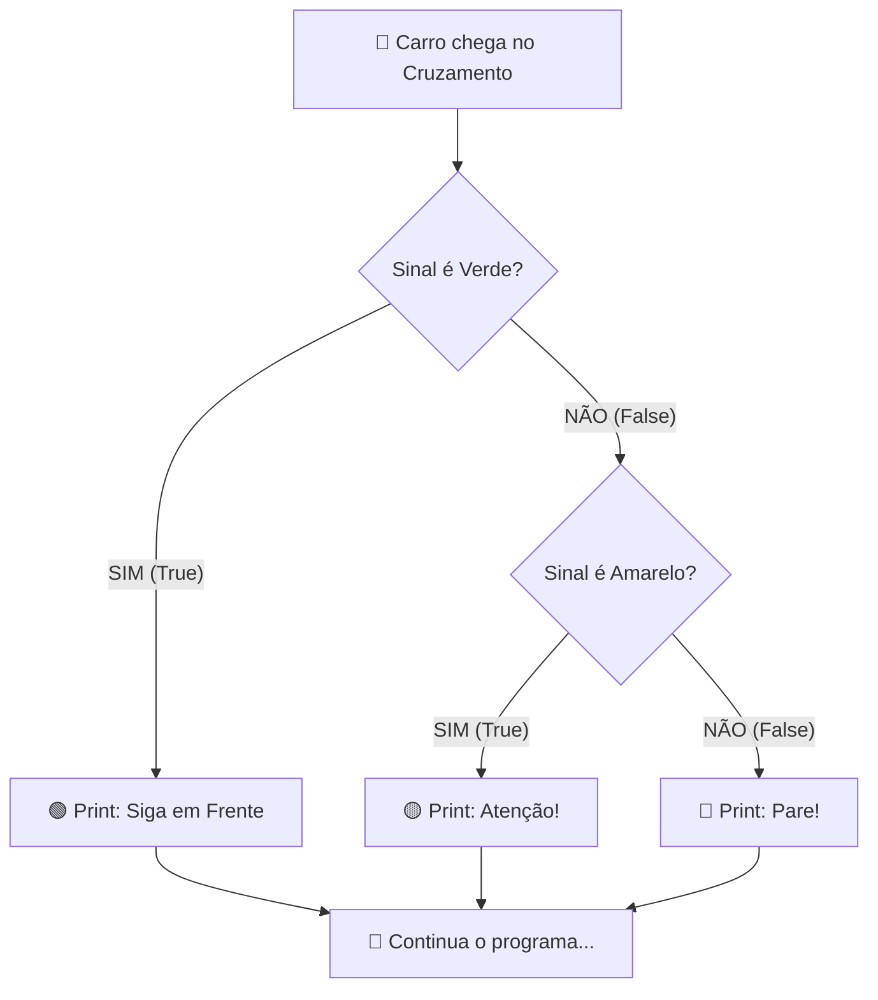

# 🧠 Revisão Visual: Tomada de Decisão com `if`, `elif` e `else`

> **Curso:** Python para Desktop  
> **Módulo:** 01 — Fundamentos de Python  
> **Nível:** Fixação Didática & Visual  
> **Tempo estimado de leitura:** 20 min  

---

## 🎯 Por que esta revisão é para você?

Se em algum momento você olhou para um bloco de `if`, `elif` e `else` e ficou se perguntando:
* *"Por que o Python pulou essa linha?"*
* *"Onde eu coloco os dois pontos `:` e a indentação?"*
* *"Quando devo usar `elif` em vez de outro `if`?"*

**Respire fundo: isso é completamente normal!** Toda pessoa que aprende a programar passa por esse momento. Nesta aula, vamos esquecer os termos difíceis e entender como o computador decide qual caminho seguir usando metáforas do dia a dia e fluxogramas visuais.

!!! abstract "💡 A Regra de Ouro da Tomada de Decisão"
    O computador é como um motorista em um cruzamento: ele **só pode seguir por uma pista por vez**. Assim que ele encontra a primeira resposta **Verdadeira (`True`)**, ele roda aquele bloco de código e **ignora todas as outras alternativas**.

---

## 🏬 Metáfora do Mundo Real: O Semáforo Inteligente

Pense na estrutura `if / elif / else` como um **guarda de trânsito em uma cruzamento**:

=== "🎨 Metáfora Visual"
    - **O `if` (Primeira Pergunta):** O guarda olha o semáforo. *"O sinal está verde?"* Se **SIM**, os carros passam e a conversa termina aqui.
    - **O `elif` (Plano B):** Se o sinal NÃO estava verde, o guarda faz a próxima pergunta: *"O sinal está amarelo?"* Se **SIM**, os carros desaceleram.
    - **O `else` (Caso Geral / Sobra):** Se o sinal não estava nem verde nem amarelo, o guarda não precisa nem perguntar: só restou o vermelho, então **PARE**.

=== "💻 No Python"
    ```python
    sinal = "amarelo"

    if sinal == "verde":
        print("Siga em frente! 🟢")
    elif sinal == "amarelo":
        print("Atenção! Desacelere! 🟡")
    else:
        print("Pare imediatamente! 🔴")
    ```

=== "🧠 O que Acontece na Memória"
    1. O Python cria a variável `sinal` com o valor `"amarelo"`.
    2. Testa `sinal == "verde"` -> Resultado: **`False`** (Falso). O Python **pula** o bloco do `if`.
    3. Testa `sinal == "amarelo"` -> Resultado: **`True`** (Verdadeiro!).
    4. Executa `print("Atenção! Desacelere! 🟡")`.
    5. O Python **ignora completamente** a cláusula `else` e segue para o resto do programa!

---

## 📊 Fluxograma Visual do Caminho (Mermaid)

Veja no diagrama abaixo como o Python navega pelas opções:



---

## 🔍 Comparativo Visual: O que confunde os iniciantes?

<div class="grid cards" markdown>

-   :material-help-circle-outline: **Múltiplos `if` isolados**
    ---
    ```python
    if idade >= 18:
        print("Maior de idade")
    if idade >= 60:
        print("Terceira idade")
    ```
    ⚠️ **O Python testa TODAS as perguntas.** Se o aluno tiver 65 anos, as duas mensagens serão exibidas!

-   :material-check-circle-outline: **Uso do `if` + `elif` em cadeia**
    ---
    ```python
    if idade >= 60:
        print("Terceira idade")
    elif idade >= 18:
        print("Maior de idade")
    ```
    ✅ **O Python para no primeiro acerto.** Se tiver 65 anos, mostra apenas "Terceira idade" e encerra.

</div>

---

## 💻 Na Prática: Calculadora de Desconto da Loja

Vamos ver um código completo e seguro que você pode rodar no seu computador:

```python
# Entrada de dados
valor_compra = 120.0  # Em reais

print(f"Valor original da compra: R$ {valor_compra:.2f}")

# Tomada de decisão encadeada
if valor_compra >= 200.0:
    desconto = 0.20  # 20% de desconto
    print("🎉 Parabéns! Você ganhou 20% de desconto!")
elif valor_compra >= 100.0:
    desconto = 0.10  # 10% de desconto
    print("✨ Muito bem! Você ganhou 10% de desconto!")
else:
    desconto = 0.0
    print("💡 Dica: Compras acima de R$ 100 ganham desconto!")

# Cálculo final
valor_final = valor_compra * (1 - desconto)
print(f"Valor a pagar: R$ {valor_final:.2f}")
```

**Resultado no Terminal:**
```text
Valor original da compra: R$ 120.00
✨ Muito bem! Você ganhou 10% de desconto!
Valor a pagar: R$ 108.00
```

---

## ⚠️ Armadilhas & "Por que meu código deu erro?"

!!! danger "Erro #1: Confundir `=` (Atribuição) com `==` (Comparação)"
    * **ERRADO:** `if idade = 18:` -> Dá `SyntaxError`. O `=` sozinho serve para **GUARDAR** um valor na variável.
    * **CORRETO:** `if idade == 18:` -> O `==` duplo serve para **PERGUNTAR** se é igual.

!!! warning "Erro #2: Esqueceu dos dois pontos `:` no final da linha"
    Toda linha com `if`, `elif` ou `else` **DEVE terminar com `:`**. Se esquecer, o Python vai reclamar na hora!

!!! tip "Erro #3: Indentação (Espaços no início da linha)"
    Tudo o que deve rodar DENTRO do `if` precisa estar recuado (geralmente 4 espaços ou 1 TAB).
    ```python
    if aprovado:
        print("Parabéns!")  # <-- Recuado! Pertence ao IF.
    print("Fim do programa") # <-- Alinhado na esquerda! Roda sempre.
    ```

---

## 🧪 Quiz Rápido de Fixação

1. **O que será impresso na tela se `nota = 8`?**
   ```python
   if nota >= 5:
       print("Aprovado")
   if nota >= 7:
       print("Excelente")
   ```
??? check "Ver Resposta Comentada"
    Será impresso **ambas as frases**:
    `Aprovado`  
    `Excelente`  
    **Por quê?** Porque usamos dois `if` separados! O Python testou a primeira condição (8 >= 5 -> `True`) e depois testou a segunda condição (8 >= 7 -> `True`). Se quisesse que só uma rodasse, deveria usar `elif`.

2. **Qual é a diferença entre `=` e `==`?**
??? check "Ver Resposta Comentada"
    - `=` é para **guardar** (atribuir): `nome = "Ana"` (Guarde "Ana" dentro da caixa `nome`).
    - `==` é para **comparar** (perguntar): `if nome == "Ana":` (O conteúdo da caixa `nome` é igual a "Ana"?).

---

## ➡️ Próximo Passo

Agora que você dominou a visualização do `if/elif/else`, experimente rodar o código acima no seu editor.

!!! info "Você está pronto!"
    Com esta base visual, você conseguirá construir fluxos de decisão muito mais avançados nas próximas aulas!
