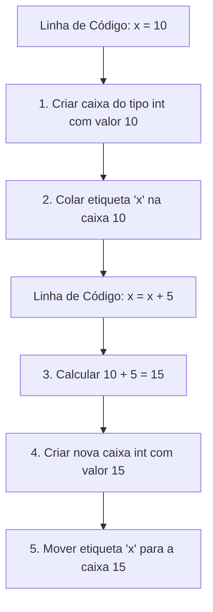

# 🧠 Revisão Visual: Memória, Variáveis e Tipos de Dados

> **Curso:** Python para Desktop  
> **Módulo:** 00 — Central de Revisão Visual  
> **Nível:** Fixação Didática & Visual  
> **Tempo estimado de leitura:** 20 min  

---

## 🎯 Por que esta revisão é para você?

Se você já se pegou perguntando:
* *"Por que não posso somar `10` com `"10"`?"*
* *"O que acontece na memória do computador quando crio um `nome = "Ana"`?"*
* *"Como o Python sabe se algo é número ou texto sem eu dizer?"*

**Fique tranquilo!** A memória do computador é apenas uma grande prateleira organizada. Nesta aula visual, vamos entender de forma definitiva como as variáveis funcionam usando a metáfora das **Caixas Etiquetadas**.

!!! abstract "💡 A Regra de Ouro das Variáveis"
    Uma variável **NÃO guarda o valor diretamente**: ela é uma **etiqueta adesiva** colada em uma caixa armazenada na memória.

---

## 🏬 Metáfora do Mundo Real: O Armazém de Caixas Etiquetadas

Imagine um armazém com milhares de caixas transparentes de tamanhos diferentes:

=== "🎨 Metáfora Visual"
    - **A Caixa (`Objeto na Memória`):** É o espaço físico onde o dado mora. Uma caixa para números inteiros (`int`), uma para textos (`str`), uma para decimais (`float`) e uma para liga/desliga (`bool`).
    - **A Etiqueta (`Nome da Variável`):** É o nome que você inventa (ex: `preco`, `idade`). Você cola essa etiqueta na caixa para encontrá-la rapidamente.
    - **O Operador `=` (`Colar a Etiqueta`):** O sinal `=` não significa igualdade matemática! Significa: *"Pegue esta etiqueta e cole nesta caixa!"*.

=== "💻 No Python"
    ```python
    idade = 25          # Caixa int com etiqueta 'idade'
    preco = 49.90       # Caixa float com etiqueta 'preco'
    nome = "Carlos"     # Caixa str com etiqueta 'nome'
    ativo = True        # Caixa bool com etiqueta 'ativo'
    ```

=== "🧠 O que Acontece na Memória"
    1. O Python cria um objeto `25` na memória.
    2. Cola a etiqueta `idade` nesse objeto.
    3. Se você fizer `idade = 26`, o Python cria o objeto `26` e **move a etiqueta `idade`** para a nova caixa! A caixa antiga `25` é descartada.

---

## 📊 Fluxograma do Ciclo de Vida de uma Variável (Mermaid)



---

## 🔍 Comparativo Visual dos 4 Tipos Básicos

<div class="grid cards" markdown>

-   :material-numeric: **`int` (Inteiros)**
    ---
    **Exemplo:** `10`, `-5`, `0`  
    **Metáfora:** Contagem de objetos inteiros (ex: quantidade de alunos). Não aceita vírgula.

-   :material-decimal: **`float` (Decimais)**
    ---
    **Exemplo:** `19.99`, `-3.5`, `0.0`  
    **Metáfora:** Medições com precisão (ex: preço, altura, peso). Sempre usa PONTO `.`, nunca vírgula!

-   :material-format-quote-close: **`str` (Texto / String)**
    ---
    **Exemplo:** `"Ana"`, `'Python 3'`, `"123"`  
    **Metáfora:** Uma corrente de caracteres entre aspas. Tudo dentro das aspas vira texto!

-   :material-toggle-switch: **`bool` (Booleano)**
    ---
    **Exemplo:** `True` ou `False`  
    **Metáfora:** Um interruptor de luz. Só tem dois estados possíveis: Ligado (`True`) ou Desligado (`False`).

</div>

---

## 💻 Na Prática: Conversão de Tipos (Casting)

Veja o que acontece quando tentamos misturar tipos:

```python
# Entrada do usuário (input SEMPRE retorna string/texto!)
idade_texto = "20" 
taxa_texto = "5.5"

# Se somar texto com texto, o Python junta (concatena)!
resultado_errado = idade_texto + "5"
print(f"Texto + Texto: {resultado_errado}")  # Saída: "205" (ERRADO!)

# Solução: Converter (Casting) para int e float
idade_numero = int(idade_texto)
taxa_numero = float(taxa_texto)

resultado_correto = idade_numero + 5
print(f"Número + Número: {resultado_correto}")  # Saída: 25 (CORRETO!)
```

---

## ⚠️ Armadilhas & "Por que meu código deu erro?"

!!! danger "Erro #1: `TypeError: can only concatenate str (not "int") to str`"
    * **Causa:** Você tentou fazer `"Idade: " + 25`. O Python não sabe se deve somar ou juntar texto.
    * **Solução:** Use f-strings! `f"Idade: {idade}"` ou converta: `"Idade: " + str(25)`.

!!! warning "Erro #2: Usar vírgula `,` em vez de ponto `.` em números decimais"
    * `preco = 19,90` -> Dá erro de sintaxe ou cria uma tupla!
    * **Correto:** `preco = 19.90` (no Python, padrão americano de ponto decimal).

---

## 🧪 Quiz Rápido de Fixação

1. **Qual é o tipo da variável `x` na linha `x = "100"`?**
??? check "Ver Resposta Comentada"
    É uma **`str` (String/Texto)**, porque o valor `100` está entre aspas duplas `" "`.

2. **O que acontece se fizer `print(2 + 2)` vs `print("2" + "2")`?**
??? check "Ver Resposta Comentada"
    - `2 + 2` -> Dá **`4`** (Soma matemática de inteiros).
    - `"2" + "2"` -> Dá **`"22"`** (Concatenação de textos).
