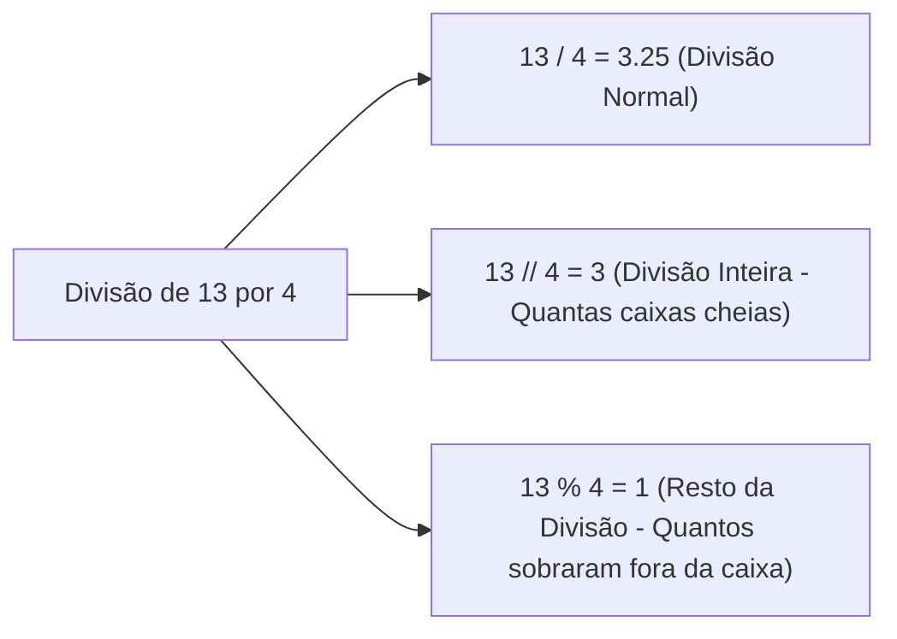

# 🧠 Revisão Visual: Operadores Aritméticos e Lógicos

> **Curso:** Python para Desktop  
> **Módulo:** 00 — Central de Revisão Visual  
> **Nível:** Fixação Didática & Visual  
> **Tempo estimado de leitura:** 20 min  

---

## 🎯 Por que esta revisão é para você?

Se você já travou com perguntas do tipo:
* *"Para que serve o `%` (módulo) no Python? É porcentagem?"*
* *"Qual a diferença entre o `/` simples e o `//` duplo?"*
* *"Como funciona o `and` e o `or` quando misturamos várias condições?"*

**Fique tranquilo!** Operadores são apenas os "verbos" das frases em código. Nesta aula visual, vamos entender a **Balança da Comparação** e a **Tabela Verdade sem Decoreba**.

!!! abstract "💡 A Regra de Ouro dos Operadores"
    - **Aritméticos**: Transformam números em um **novo número**.
    - **Relacionais**: Comparam valores e retornam **`True` ou `False`**.
    - **Lógicos (`and`/`or`/`not`)**: Combinam booleanos para formar decisões complexas.

---

## 🏬 Metáfora do Mundo Real: A Catraca do Parque de Diversões

Imagine a regra para entrar na montanha-russa:
- *"Você precisa ter pelo menos 1.50m de altura **AND** ter mais de 12 anos."*

=== "🎨 Metáfora Visual (and / or)"
    - **Operador `AND` (Exigente):** Ambas as portas precisam estar abertas. Se você tiver 1.80m mas 10 anos -> **ENTRADA NEGADA (`False`)**.
    - **Operador `OR` (Flexível):** Pelo menos UMA porta precisa estar aberta. Ex: *"Desconto para Estudante **OR** Idoso"*. Se for estudante -> **DESCONTO CONCEDIDO (`True`)**.
    - **Operador `NOT` (Inversor):** Inverte o sinal. Se a luz está acesa (`True`), `not` torna desligada (`False`).

=== "💻 No Python"
    ```python
    altura = 1.65
    idade = 14

    pode_entrar = (altura >= 1.50) and (idade >= 12)
    print(f"Pode entrar na montanha-russa? {pode_entrar}")  # True
    ```

---

## 📊 Tabela de Operadores Aritméticos (Especial: Divisão e Resto)

Muitos alunos confundem a divisão inteira `//` e o resto `%`. Veja este gráfico visual:



---

## 🔍 Comparativo Visual: Tabela Verdade Prática

<div class="grid cards" markdown>

-   :material-check-all: **`AND` (E)**
    ---
    Só dá `True` se **TUDO** for verdadeiro!  
    - `True and True` -> **`True`**  
    - `True and False` -> **`False`**  
    - `False and False` -> **`False`**

-   :material-call-merge: **`OR` (OU)**
    ---
    Dá `True` se **PELO MENOS UM** for verdadeiro!  
    - `True or False` -> **`True`**  
    - `False or False` -> **`False`**  
    - `True or True` -> **`True`**

</div>

---

## 💻 Na Prática: Descobrindo se um número é Par ou Ímpar

O operador `%` (resto da divisão) é o truque mais famoso da programação para testar paridade:

```python
numero = 7

# Se o resto da divisão por 2 for ZERO, o número é PAR!
if numero % 2 == 0:
    print(f"O número {numero} é PAR!")
else:
    print(f"O número {numero} é ÍMPAR!")  # 7 % 2 sobra 1 -> Ímpar!
```

---

## ⚠️ Armadilhas & Erros Comuns

!!! danger "Erro #1: Achar que `%` calcula porcentagem"
    * `100 % 10` NÃO é 10%! É o resto da divisão de 100 por 10 (que é `0`).
    * Para calcular 10% no Python, faça: `100 * 0.10`.

!!! warning "Erro #2: Escrever `if 10 < x < 20` ou esquecer parênteses"
    Embora o Python aceite `10 < x < 20`, a forma mais explícita e recomendada para iniciantes é:  
    `if (x > 10) and (x < 20):`

---

## 🧪 Quiz Rápido de Fixação

1. **Qual o resultado de `15 % 4`?**
??? check "Ver Resposta Comentada"
    É **`3`**. Porque 4 x 3 = 12, e sobram 3 para chegar a 15.

2. **Qual o resultado de `not (5 > 2)`?**
??? check "Ver Resposta Comentada"
    É **`False`**. Porque `5 > 2` é `True`, e o `not` inverte o `True` para `False`.
