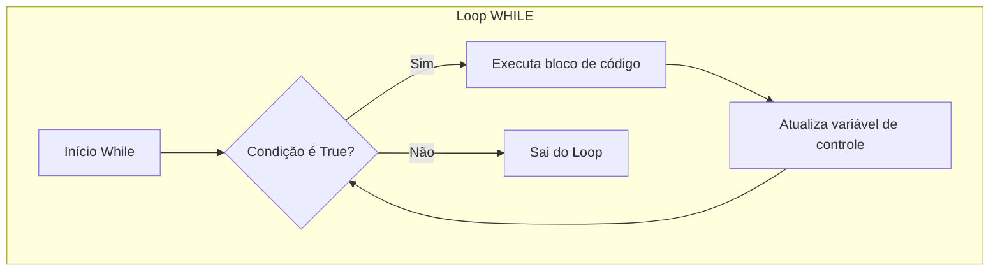

# 🧠 Revisão Visual: Laços de Repetição (`for` e `while`)

> **Curso:** Python para Desktop  
> **Módulo:** 00 — Central de Revisão Visual  
> **Nível:** Fixação Didática & Visual  
> **Tempo estimado de leitura:** 20 min  

---

## 🎯 Por que esta revisão é para você?

Se você já sentiu confusão com:
* *"Quando devo usar `for` e quando devo usar `while`?"*
* *"Como funciona o `range(0, 5)`? Por que ele não inclui o 5?"*
* *"O que acontece quando meu programa entra em Loop Infinito e trava tudo?"*

**Respire fundo!** Loops são a superpotência dos computadores: fazer tarefas repetitivas milhares de vezes por segundo sem cansar. Nesta aula visual, vamos entender o funcionamento dos laços de repetição.

!!! abstract "💡 A Regra de Ouro dos Loops"
    - **`for` (Contador / Esteira)**: Use quando você **SABE previamente** quantas vezes vai repetir ou quer percorrer uma lista.
    - **`while` (Guardião da Condição)**: Use quando você **NÃO SABE** quantas vezes vai repetir (repete enquanto uma condição for verdadeira).

---

## 🏬 Metáfora do Mundo Real: A Esteira de Fábrica vs. O Tanque de Combustível

=== "🎨 Metáfora Visual (FOR)"
    Imagine uma **esteira rolante com 5 caixas**. A esteira anda automaticamente, pega a caixa 1, processa, pega a caixa 2, processa... até chegar na última caixa. Você sabe exatamente onde a esteira começa e termina.

=== "🎨 Metáfora Visual (WHILE)"
    Imagine dirigir um carro. *"Enquanto tiver gasolina no tanque (`tanque > 0`), continue dirigindo."* Você não sabe quantas voltas vai dar; você apenas dirige até o ponteiro chegar no zero.

---

## 📊 Fluxograma de Execução do `while` vs `for` (Mermaid)



---

## 🔍 O Mistério do `range(inicio, fim)`

Uma das maiores dúvidas dos iniciantes é por que `range(1, 5)` gera `1, 2, 3, 4` e **NÃO inclui o 5**.

<div class="grid cards" markdown>

-   :material-numeric-1-box: **O limite superior é EXCLUSIVO**
    ---
    `range(1, 5)` significa: *"Comece no 1 e pare ANTES de chegar no 5"*.  
    **Gerados:** `1, 2, 3, 4`.

-   :material-repeat-once: **Por que é assim?**
    ---
    Porque `range(5)` gera exatamente **5 elementos** se começarmos do zero: `0, 1, 2, 3, 4`. Isso facilita trabalhar com o tamanho de listas!

</div>

---

## 💻 Na Prática: `for` vs `while` lado a lado

=== "Exemplo com FOR (Sabemos o limite)"
    ```python
    print("Contagem regressiva do FOR:")
    for i in range(3, 0, -1):  # Começa no 3, vai até > 0, diminuindo 1
        print(f"🚀 Faltam {i} segundos...")
    print("BOOM! 💥")
    ```

=== "Exemplo com WHILE (Aguardando resposta do usuário)"
    ```python
    senha_correta = "python123"
    tentativa = ""

    # Enquanto a senha digitada for diferente da correta, continue pedindo!
    while tentativa != senha_correta:
        tentativa = input("Digite a senha de acesso: ")
        if tentativa != senha_correta:
            print("❌ Senha incorreta! Tente novamente.")

    print("🔓 Acesso liberado com sucesso!")
    ```

---

## ⚠️ Armadilhas & Erros Comuns

!!! danger "Erro Fatal: O Loop Infinito no `while`"
    Se você esquecer de atualizar a variável dentro do `while`, a condição nunca muda para `False` e o programa trava!
    ```python
    contador = 1
    while contador <= 5:
        print(contador)
        # ESQUECEU DE FAZER: contador += 1 !!!
        # Resultado: Vai imprimir 1 para sempre até o computador travar!
    ```

!!! tip "Como parar um loop infinito no terminal?"
    Pressione `Ctrl + C` no terminal para interromper a execução forçadamente.

---

## 🧪 Quiz Rápido de Fixação

1. **Quantas vezes a frase será impressa em `for x in range(3): print("Olá")`?**
??? check "Ver Resposta Comentada"
    Será impressa **3 vezes** (para `x = 0`, `x = 1` e `x = 2`).

2. **Qual é o melhor loop para validar se o usuário digitou uma opção válida no menu?**
??? check "Ver Resposta Comentada"
    O **`while`**, pois não sabemos de primeira quantas vezes o usuário vai digitar errado antes de acertar!
