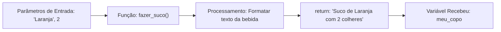

# 🧠 Revisão Visual: Funções, Parâmetros e `return`

> **Curso:** Python para Desktop  
> **Módulo:** 00 — Central de Revisão Visual  
> **Nível:** Fixação Didática & Visual  
> **Tempo estimado de leitura:** 20 min  

---

## 🎯 Por que esta revisão é para você?

Se você já se fez perguntas como:
* *"Para que serve criar funções se posso escrever o código direto?"*
* *"Qual a diferença entre usar `print()` dentro da função e usar `return`?"*
* *"O que são os argumentos que passamos dentro dos parênteses `()`?"*

**Fique tranquilo!** Funções são os blocos de construção mais importantes da programação moderna. Nesta aula visual, vamos entender as funções usando a metáfora da **Máquina de Fazer Suco (Processador de Alimentos)**.

!!! abstract "💡 A Regra de Ouro das Funções"
    Uma função é uma **mini-máquina reutilizável**: você entrega matérias-primas (**parâmetros**), a máquina processa o trabalho internamente, e te devolve o produto final (**`return`**).

---

## 🏬 Metáfora do Mundo Real: O Liquidificador / Máquina de Suco

=== "🎨 Metáfora Visual"
    - **O Nome da Função (`def fazer_suco`):** É o nome do botão da máquina.
    - **Os Parâmetros (`fruta, acucar`):** É o que você joga dentro do copo da máquina antes de ligar.
    - **O Corpo da Função (`bloco recuado`):** As lâminas girando e batendo o ingrediente.
    - **O `return` (`O Suco no Copo`):** É o produto final que sai pela bica. **Se não houver `return`, o suco fica preso dentro da máquina!**

=== "💻 No Python"
    ```python
    def fazer_suco(fruta, colheres_acucar):
        # Processamento interno
        bebida = f"Suco de {fruta} com {colheres_acucar} colher(es) de açúcar"
        return bebida  # Devolve a bebida pronta!

    # Chamando a função e guardando o resultado no copo (variável)
    meu_copo = fazer_suco("Laranja", 2)
    print(meu_copo)
    ```

---

## 📊 Fluxograma de Entrada, Processamento e Saída (Mermaid)



---

## 🔍 `print()` vs `return`: A Maior Confusão dos Iniciantes!

<div class="grid cards" markdown>

-   :material-printer: **`print()` — O Panfleto na Janela**
    ---
    O `print()` apenas **MOSTRA** um texto na tela do computador. Ele **NÃO salva** nem entrega o resultado para o resto do programa usar depois. A informação morre na tela!

-   :material-tray-arrow-up: **`return` — O Pacote Entregue**
    ---
    O `return` **ENTREGA** o valor resultante de volta para quem chamou a função. Você pode guardar esse valor em uma variável, salvar no banco de dados ou passar para outra função!

</div>

---

## 💻 Na Prática: Calculadora de Imposto Profissional

Veja como usar funções limpas para organizar a lógica de um programa desktop:

```python
def calcular_imposto(valor_produto, aliquota=0.15):
    """Calcula o valor do imposto com alíquota padrão de 15%."""
    imposto = valor_produto * aliquota
    return imposto

def calcular_preco_final(valor_produto):
    """Usa a primeira função para calcular o preço final com imposto."""
    valor_imposto = calcular_imposto(valor_produto)
    preco_final = valor_produto + valor_imposto
    return preco_final

# Uso no programa principal:
notebook_base = 3000.0
total = calcular_preco_final(notebook_base)

print(f"Valor base: R$ {notebook_base:.2f}")
print(f"Valor com Imposto: R$ {total:.2f}")
```

---

## ⚠️ Armadilhas & Erros Comuns

!!! danger "Erro #1: Confundir variáveis locais com globais"
    Variáveis criadas DENTRO de uma função nascem e morrem dentro dela!
    ```python
    def minha_funcao():
        segredo = "1234"

    minha_funcao()
    print(segredo)  # ❌ NameError: name 'segredo' is not defined!
    ```

!!! warning "Erro #2: Esqueceu de chamar a função usando `()`"
    * `print(calcular_imposto)` -> Imprime o endereço de memória da função `<function ...>`.
    * `print(calcular_imposto(100))` -> Chama a função passando `100` e imprime o resultado `15.0`.

---

## 🧪 Quiz Rápido de Fixação

1. **O que acontece se uma função não tiver a palavra `return` no final?**
??? check "Ver Resposta Comentada"
    Ela retorna o valor especial **`None`** (Nada) por padrão no Python.

2. **Qual a vantagem de usar funções no código?**
??? check "Ver Resposta Comentada"
    Evitar repetição de código (Princípio DRY - Don't Repeat Yourself), facilitar testes e deixar o código limpo e organizado!
