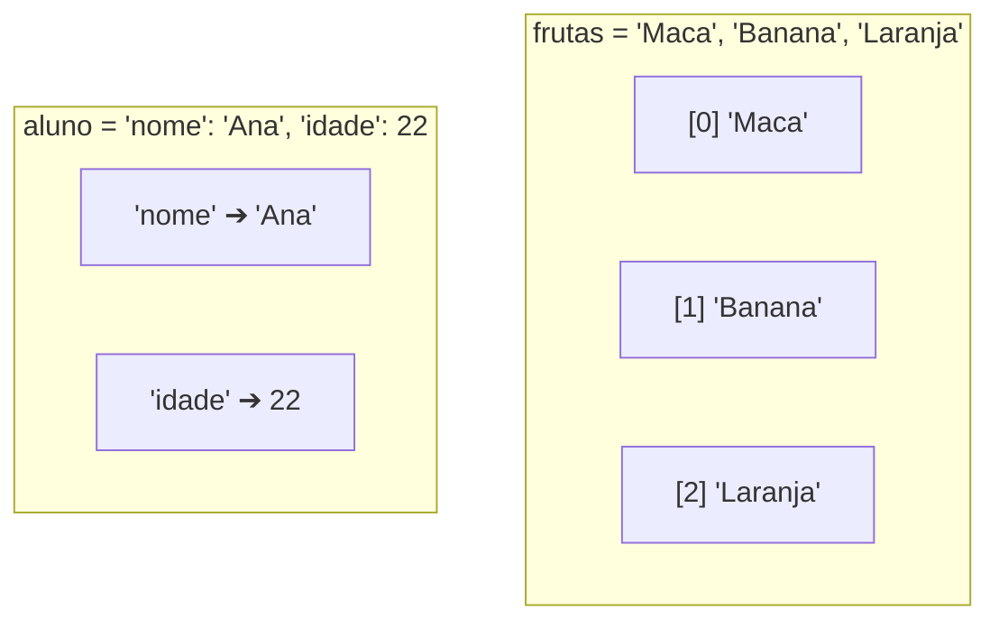

# 🧠 Revisão Visual: Coleções (Listas, Dicionários e Tuplas)

> **Curso:** Python para Desktop  
> **Módulo:** 00 — Central de Revisão Visual  
> **Nível:** Fixação Didática & Visual  
> **Tempo estimado de leitura:** 20 min  

---

## 🎯 Por que esta revisão é para você?

Se você já se pegou em dúvida sobre:
* *"Quando devo usar uma Lista `[]` e quando devo usar um Dicionário `{}`?"*
* *"Por que o primeiro item de uma lista fica na posição `0` e não `1`?"*
* *"Como encontrar uma informação dentro de um dicionário sem dar erro?"*

**Fique tranquilo!** Coleções são simplesmente formas de organizar múltiplos dados juntos. Nesta aula visual, vamos entender as diferenças usando a metáfora do **Gaveteiro Numerado** e da **Agenda Telefônica com Etiquetas**.

!!! abstract "💡 A Regra de Ouro das Coleções"
    - **Lista `[ ]`**: Uma fila de gavetas **ordenadas por número (índices 0, 1, 2...)**.
    - **Dicionário `{ }`**: Uma coleção organizada por **chaves com nomes (`"nome": "Ana"`)**.
    - **Tupla `( )`**: Uma lista **imutável (lacrada com cadeado)** que não pode ser alterada após criada.

---

## 🏬 Metáfora do Mundo Real: O Gaveteiro vs O Armário com Chaves

=== "🎨 Metáfora Visual (LISTA)"
    Pense em uma gaveteiro de arquivo:
    - Gaveta 0: `"Maçã"`
    - Gaveta 1: `"Banana"`
    - Gaveta 2: `"Laranja"`  
    Você busca as coisas pelo **número da posição** (`frutas[0]`).

=== "🎨 Metáfora Visual (DICIONÁRIO)"
    Pense em um fichário onde cada ficha tem um rótulo:
    - `"nome"` ➔ `"Maria"`
    - `"idade"` ➔ `30`
    - `"cidade"` ➔ `"São Paulo"`  
    Você busca as coisas pela **etiqueta com o nome da chave** (`aluno["nome"]`).

---

## 📊 Estrutura de Índices da Lista vs Dicionário (Mermaid)



---

## 🔍 Comparativo das 3 Coleções Principais

<div class="grid cards" markdown>

-   :material-format-list-numbered: **Listas `[ ]`**
    ---
    - **Sintaxe:** `frutas = ["Maçã", "Banana"]`
    - **Mutável:** Permite adicionar (`append`), remover (`pop`) e alterar itens.
    - **Acesso:** Pela posição numérica (`frutas[0]`).

-   :material-book-account-outline: **Dicionários `{ }`**
    ---
    - **Sintaxe:** `usuario = {"id": 1, "nome": "Leo"}`
    - **Mutável:** Permite alterar valores via chave `usuario["nome"] = "Lucas"`.
    - **Acesso:** Pela chave descritiva (`usuario["nome"]`).

-   :material-lock-outline: **Tuplas `( )`**
    ---
    - **Sintaxe:** `coordenadas = (-23.55, -46.63)`
    - **Imutável:** NÃO permite alterar nem adicionar nada após a criação!
    - **Uso:** Dados fixos de segurança (ex: GPS, configurações fixas).

</div>

---

## 💻 Na Prática: Manipulando Listas e Dicionários no Python

```python
# 1. Trabalhando com Lista
produtos = ["Notebook", "Mouse", "Teclado"]
produtos.append("Monitor")  # Adiciona ao final
print(f"Primeiro produto: {produtos[0]}")  # Notebook
print(f"Total de produtos: {len(produtos)}") # 4

# 2. Trabalhando com Dicionário
cliente = {
    "nome": "Mariana Silva",
    "email": "mariana@email.com",
    "compras": 3
}

# Acesso seguro com .get() (evita erros se a chave não existir!)
telefone = cliente.get("telefone", "Não informado")
print(f"Cliente: {cliente['nome']}")
print(f"Telefone: {telefone}")
```

---

## ⚠️ Armadilhas & Erros Comuns

!!! danger "Erro #1: `IndexError: list index out of range`"
    * **Causa:** Você tentou acessar uma posição que não existe (ex: buscar `frutas[3]` em uma lista com 3 elementos, pois os índices vão de 0 a 2!).
    * **Solução:** Lembre-se que o último índice é sempre `tamanho - 1`.

!!! warning "Erro #2: `KeyError: 'chave_inexistente'` em Dicionários"
    * **Causa:** Tentar acessar `cliente["cpf"]` quando o dicionário não possui a chave `"cpf"`.
    * **Solução:** Use o método `.get()`! Ex: `cliente.get("cpf", "Sem CPF")`.

---

## 🧪 Quiz Rápido de Fixação

1. **Se `cores = ["Verde", "Azul", "Vermelho"]`, qual valor é retornado em `cores[1]`?**
??? check "Ver Resposta Comentada"
    Retorna **`"Azul"`**, pois a contagem de índices começa no zero (`0` = Verde, `1` = Azul).

2. **Qual coleção usar para representar um usuário do sistema com Nome, E-mail e Idade?**
??? check "Ver Resposta Comentada"
    Um **Dicionário `{}`**, pois permite identificar cada informação com uma chave descritiva clara (`"nome"`, `"email"`, `"idade"`).
