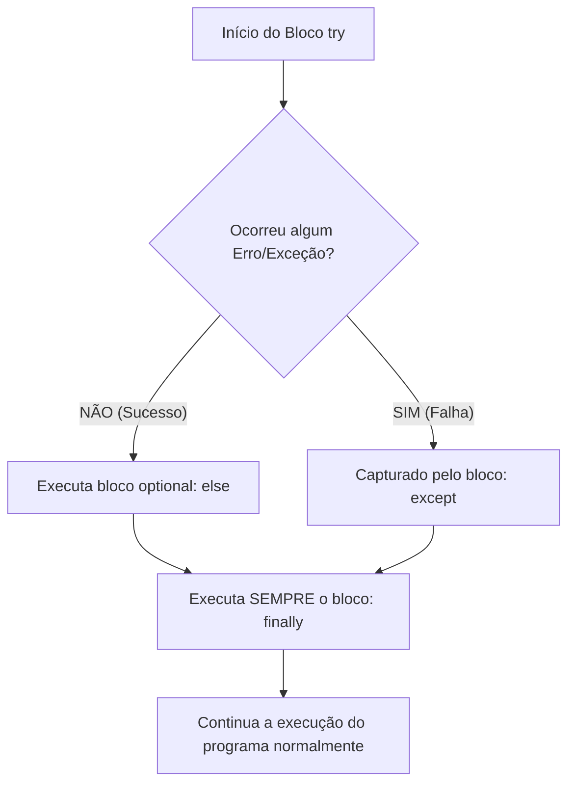

# 🧠 Revisão Visual: Tratamento de Erros (`try` / `except`)

> **Curso:** Python para Desktop  
> **Módulo:** 00 — Central de Revisão Visual  
> **Nível:** Fixação Didática & Visual  
> **Tempo estimado de leitura:** 20 min  

---

## 🎯 Por que esta revisão é para você?

Se você já passou por situações como:
* *"O usuário digitou letras onde deveria ser um número e o programa fechou sozinho!"*
* *"O aplicativo tentou abrir um arquivo inexistente e deu uma tela vermelha no terminal!"*
* *"Como faço para meu programa não travar na frente do cliente?"*

**Fique tranquilo!** Tratamento de erros é o escudo protetor de qualquer sistema profissional. Nesta aula visual, vamos entender como capturar exceções usando a metáfora da **Rede de Proteção dos Trapezistas de Círco**.

!!! abstract "💡 A Regra de Ouro da Resiliência"
    Erros em tempo de execução (exceções) vão acontecer. O bloco `try / except` serve para **colocar uma rede de segurança**: se algo falhar, o programa cai na rede em vez de se espatifar no chão.

---

## 🏬 Metáfora do Mundo Real: A Rede de Segurança do Circo

=== "🎨 Metáfora Visual"
    - **O Bloco `try` (O Salto Perigoso):** É o trecho de código onde algo perigoso pode acontecer (ex: ler arquivo, dividir números, conectar ao banco).
    - **O Bloco `except` (A Rede de Segurança):** Se o código escorregar durante o salto, em vez de o programa fechar com erro fatal, ele cai suavemente na rede e executa um plano de emergência amigável.
    - **O Bloco `finally` (O Limpador do Palco):** Trecho de código que roda **SEMPRE**, tenha acontecido erro ou não (ex: fechar arquivos, encerrar conexões).

=== "💻 No Python"
    ```python
    try:
        idade = int(input("Digite sua idade: "))
        print(f"Sua idade é {idade}")
    except ValueError:
        # Cai aqui se o usuário digitar 'vinte' em vez de 20
        print("❌ Ops! Você precisa digitar um número inteiro válido.")
    finally:
        print("Operação finalizada.")
    ```

---

## 📊 Fluxograma de Execução do `try / except / else / finally` (Mermaid)



---

## 🔍 Os 3 Erros Mais Frequentes em Aplicações Desktop

<div class="grid cards" markdown>

-   :material-alert-rhombus-outline: **`ValueError`**
    ---
    **Motivo:** Tentar converter um texto inválido para número.  
    **Exemplo:** `int("abc")` ou `float("10,5")`.

-   :material-file-remove-outline: **`FileNotFoundError`**
    ---
    **Motivo:** Tentar abrir um arquivo `.txt`, `.json` ou banco de dados que não existe no disco.  
    **Exemplo:** `open("relatorio.txt")`.

-   :material-division: **`ZeroDivisionError`**
    ---
    **Motivo:** Tentar dividir qualquer número por zero na matemática.  
    **Exemplo:** `10 / 0`.

</div>

---

## 💻 Na Prática: Leitura Segura de Arquivos sem Crash

Veja como tratar erros de arquivos e números como um desenvolvedor sênior:

```python
def ler_configuracao_segura(caminho_arquivo):
    try:
        with open(caminho_arquivo, "r", encoding="utf-8") as f:
            conteudo = f.read()
            return conteudo
    except FileNotFoundError:
        print(f"⚠️ Arquivo '{caminho_arquivo}' não encontrado! Usando padrão.")
        return "CONFIGURACAO_PADRAO"
    except Exception as e:
        print(f"❌ Erro inesperado ao ler arquivo: {e}")
        return None

# Teste com arquivo inexistente:
config = ler_configuracao_segura("config_inexistente.txt")
print(f"Configuração ativa: {config}")
```

---

## ⚠️ Armadilhas & Erros Comuns

!!! danger "Erro Crítico: `except:` genérico sem tratamento (Engolir Erros)"
    Evite usar `except:` sem especificar o tipo do erro! Isso oculta bugs sérios do sistema.
    ```python
    # BAD PRACTICE ❌
    try:
        processar_dados()
    except:
        pass # Engole o erro e você nunca descobre o que quebrou!
    ```

!!! tip "Boa Prática: Seja Específico!"
    Trate cada erro com a mensagem adequada para o usuário.
    ```python
    # GOOD PRACTICE ✅
    try:
        processar_dados()
    except ValueError:
        mostrar_aviso("Digite apenas números.")
    except FileNotFoundError:
        mostrar_aviso("Arquivo não encontrado.")
    ```

---

## 🧪 Quiz Rápido de Fixação

1. **O bloco `finally` roda quando ocorre um erro ou quando dá tudo certo?**
??? check "Ver Resposta Comentada"
    O bloco `finally` roda **SEMPRE**, independentemente de ter ocorrido erro ou sucesso!

2. **Para que serve a cláusula `except Exception as e`?**
??? check "Ver Resposta Comentada"
    Serve como captura genérica para guardar a mensagem detalhada do erro na variável `e`, permitindo gravar o problema em logs de sistema.
