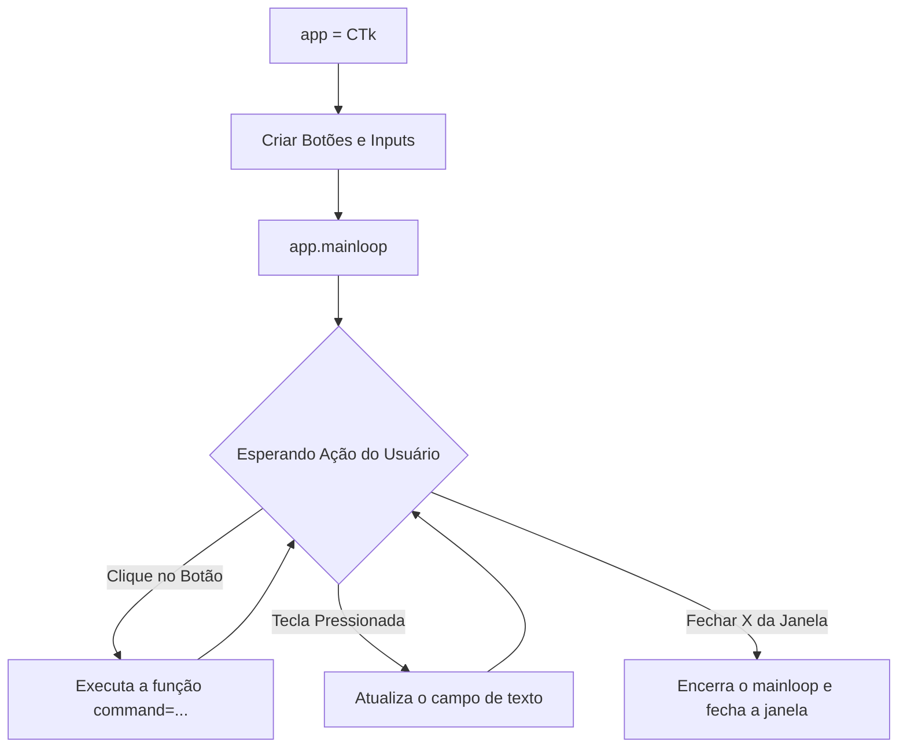

# 🧠 Revisão Visual: Interfaces Gráficas com Tkinter & CustomTkinter

> **Curso:** Python para Desktop  
> **Módulo:** 00 — Central de Revisão Visual  
> **Nível:** Fixação Didática & Visual  
> **Tempo estimado de leitura:** 25 min  

---

## 🎯 Por que esta revisão é para você?

Se você já se pegou em dúvida sobre:
* *"Por que criei um botão mas ele não aparece na tela?"*
* *"Qual a diferença entre `pack()` e `grid()` para posicionar elementos?"*
* *"Como conectar o clique de um botão a uma função Python?"*

**Fique tranquilo!** Construir interfaces gráficas é como montar um **quebra-cabeça de componentes**. Nesta aula visual, vamos entender como as janelas desktop funcionam usando a metáfora da **Árvore de Widgets e da Planta Baixa**.

!!! abstract "💡 A Regra de Ouro das UIs no Python"
    Todo elemento visual (Botão, Caixa de Texto, Rótulo) precisa de duas coisas obrigatoriamente:
    1. **Instanciação**: `botao = ctk.CTkButton(janela, text="Clique")`
    2. **Posicionamento**: `botao.pack()` ou `botao.grid(row=0, column=0)` — **Se não posicionar, o elemento fica invisível!**

---

## 🏬 Metáfora do Mundo Real: A Árvore de Componentes

=== "🎨 Metáfora Visual"
    - **A Janela Principal (`Tk` / `CTk`):** É o terreno ou a moldura do quadro onde tudo será colado.
    - **Os Frames (`Quadros`):** São como cômodos de uma casa. Servem para agrupar botões e inputs de uma mesma região (ex: painel de login, cabeçalho).
    - **Os Widgets (`Botões, Inputs, Rótulos`):** São os móveis dentro de cada cômodo.

=== "💻 No CustomTkinter"
    ```python
    import customtkinter as ctk

    # 1. Criar a janela
    app = ctk.CTk()
    app.title("Minha Aplicação Desktop")
    app.geometry("400x300")

    # 2. Criar widget
    label = ctk.CTkLabel(app, text="Olá, Usuário!")
    label.pack(pady=20) # Posicionar!

    # 3. Iniciar loop de eventos
    app.mainloop()
    ```

---

## 📊 O Ciclo do Event Loop (`mainloop`) (Mermaid)

Por que a janela não fecha sozinha no Python? Por causa do `mainloop()`:



---

## 🔍 Gerenciadores de Layout: `pack()` vs `grid()`

<div class="grid cards" markdown>

-   :material-view-day-outline: **`pack()` — Empilhamento Automático**
    ---
    Empilha os elementos um embaixo do outro (ou lado a lado).  
    - **Uso:** Telas simples, listas verticais ou centralização rápida.  
    - **Parâmetros:** `pady=10`, `fill="x"`.

-   :material-grid: **`grid()` — A Tabela com Linhas e Colunas**
    ---
    Organiza a tela como uma planilha Excel (`row` e `column`).  
    - **Uso:** Formulários complexos (Rótulo na esquerda, Campo de entrada na direita).  
    - **Parâmetros:** `row=0, column=1`, `padx=5, pady=5`.

</div>

---

## 💻 Na Prática: Formulário de Login com CustomTkinter

```python
import customtkinter as ctk

# Configurar tema moderno
ctk.set_appearance_mode("dark")
ctk.set_default_color_theme("blue")

app = ctk.CTk()
app.title("Acesso ao Sistema")
app.geometry("350x400")

def acao_login():
    usuario = entry_user.get()
    print(f"Tentativa de login para: {usuario}")
    lbl_status.configure(text=f"Bem-vindo, {usuario}!", text_color="green")

# Rótulo do Título
lbl_titulo = ctk.CTkLabel(app, text="Faça seu Login", font=("Roboto", 20, "bold"))
lbl_titulo.pack(pady=20)

# Entrada de Usuário
entry_user = ctk.CTkEntry(app, placeholder_text="Digite seu usuário")
entry_user.pack(pady=10, padx=20, fill="x")

# Entrada de Senha
entry_pass = ctk.CTkEntry(app, placeholder_text="Digite sua senha", show="*")
entry_pass.pack(pady=10, padx=20, fill="x")

# Botão Entrar
btn_login = ctk.CTkButton(app, text="ENTRAR", command=acao_login)
btn_login.pack(pady=20)

# Status
lbl_status = ctk.CTkLabel(app, text="")
lbl_status.pack(pady=5)

app.mainloop()
```

---

## ⚠️ Armadilhas & Erros Comuns

!!! danger "Erro #1: Misturar `pack()` e `grid()` no mesmo container"
    * **NUNCA** use `pack()` e `grid()` dentro da mesma janela ou do mesmo `Frame`. Isso gera um loop infinito de redimensionamento e trava o programa!

!!! warning "Erro #2: Passar `command=funcao()` com parênteses no botão"
    * **ERRADO:** `CTkButton(app, command=acao_login())` -> A função roda IMEDIATAMENTE ao abrir o programa!
    * **CORRETO:** `CTkButton(app, command=acao_login)` -> Sem parênteses! O botão guarda a referência para rodar só quando clicado.

---

## 🧪 Quiz Rápido de Fixação

1. **Para que serve o método `app.mainloop()` no final do script?**
??? check "Ver Resposta Comentada"
    Para manter a janela aberta em um loop contínuo aguardando cliques e eventos do usuário. Sem ele, o script executa e fecha na hora!

2. **Como pegar o texto digitado pelo usuário em um `CTkEntry`?**
??? check "Ver Resposta Comentada"
    Usando o método **`.get()`**. Exemplo: `texto = meu_input.get()`.
