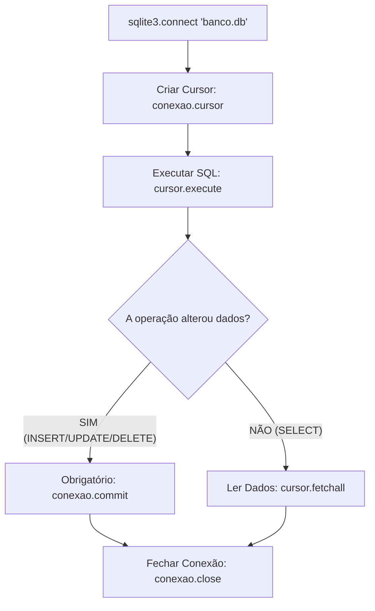

# 🧠 Revisão Visual: Banco de Dados SQLite & SQL

> **Curso:** Python para Desktop  
> **Módulo:** 00 — Central de Revisão Visual  
> **Nível:** Fixação Didática & Visual  
> **Tempo estimado de leitura:** 25 min  

---

## 🎯 Por que esta revisão é para você?

Se você já se pegou em dúvida sobre:
* *"Por que preciso de um Banco de Dados se posso salvar tudo em arquivos de texto?"*
* *"O que são as operações CRUD (`CREATE`, `READ`, `UPDATE`, `DELETE`)?"*
* *"Como conectar o Python ao SQLite sem deixar a conexão aberta vazar dados?"*

**Fique tranquilo!** Bancos de dados são simplesmente **planilhas digitais super rápidas e seguras**. Nesta aula visual, vamos entender o SQLite usando a metáfora da **Planilha Excel Automatizada por SQL**.

!!! abstract "💡 A Regra de Ouro da Persistência"
    Um banco de dados relacional guarda informações em **tabelas (linhas e colunas)**. O módulo `sqlite3` do Python envia comandos em linguagem **SQL** para o arquivo `.db` e lê os resultados de volta.

---

## 🏬 Metáfora do Mundo Real: O Arquivo Morto com um Secretário (SQL)

=== "🎨 Metáfora Visual"
    - **O Banco de Dados (`arquivo.db`):** É o prédio do arquivo da empresa.
    - **As Tabelas (`Tabela alunos`):** São as pastas com fichas organizadas em colunas (ID, Nome, E-mail).
    - **O Comandos SQL:** É o bilhete em linguagem padronizada que você entrega ao secretário: *"Busque todos os alunos aprovados"* (`SELECT * FROM alunos WHERE nota >= 7`).
    - **O `commit()`:** É o carimbo final de confirmação no documento. **Se você alterar dados e esquecer o `commit()`, as mudanças são rasgadas ao fechar o programa!**

=== "💻 No Python"
    ```python
    import sqlite3

    # 1. Conectar ao banco (cria o arquivo se não existir)
    conexao = sqlite3.connect("sistema.db")
    cursor = conexao.cursor()

    # 2. Executar SQL
    cursor.execute("""
        CREATE TABLE IF NOT EXISTS alunos (
            id INTEGER PRIMARY KEY AUTOINCREMENT,
            nome TEXT NOT NULL,
            nota REAL
        )
    """)

    # 3. Confirmar e fechar
    conexao.commit()
    conexao.close()
    ```

---

## 📊 Ciclo de Vida da Conexão com o SQLite (Mermaid)



---

## 🔍 O Alfabeto do CRUD (As 4 Operações Básicas)

<div class="grid cards" markdown>

-   :material-database-plus: **C - Create (Criar / Inserir)**
    ---
    **Comando SQL:** `INSERT INTO tabela (colunas) VALUES (valores)`  
    **Ação:** Adiciona uma nova linha de dados na tabela.

-   :material-database-search: **R - Read (Ler / Buscar)**
    ---
    **Comando SQL:** `SELECT colunas FROM tabela WHERE condicao`  
    **Ação:** Consulta e retorna dados existentes.

-   :material-database-edit: **U - Update (Atualizar)**
    ---
    **Comando SQL:** `UPDATE tabela SET coluna = novo_valor WHERE id = x`  
    **Ação:** Modifica registros existentes.

-   :material-database-remove: **D - Delete (Excluir)**
    ---
    **Comando SQL:** `DELETE FROM tabela WHERE id = x`  
    **Ação:** Remove linhas da tabela.

</div>

---

## 💻 Na Prática: Inserindo e Buscando Dados com Segurança

Sempre use **placeholders `?`** no SQL para evitar ataques de Injeção de SQL!

```python
import sqlite3

def cadastrar_aluno(nome, nota):
    # Usando 'with' a conexão confirma (commit) e fecha automaticamente!
    with sqlite3.connect("escola.db") as conexao:
        cursor = conexao.cursor()
        # NUNCA use f-strings no SQL! Use '?' por segurança.
        cursor.execute("INSERT INTO alunos (nome, nota) VALUES (?, ?)", (nome, nota))
        print(f"✅ Aluno '{nome}' cadastrado com sucesso!")

def listar_alunos():
    with sqlite3.connect("escola.db") as conexao:
        cursor = conexao.cursor()
        cursor.execute("SELECT id, nome, nota FROM alunos")
        registros = cursor.fetchall()  # Retorna lista de tuplas
        
        print("\n--- LISTA DE ALUNOS ---")
        for id_aluno, nome, nota in registros:
            print(f"ID: {id_aluno} | Nome: {nome} | Nota: {nota}")

# Teste das funções:
cadastrar_aluno("Lucas Silva", 9.5)
listar_alunos()
```

---

## ⚠️ Armadilhas & Erros Comuns

!!! danger "Erro Fatal #1: Esquecer a cláusula `WHERE` no `UPDATE` ou `DELETE`"
    * `DELETE FROM alunos` -> **APAGA A TABELA INTEIRA!**
    * `UPDATE alunos SET nota = 10` -> **DÁ NOTA 10 PARA TODOS OS ALUNOS DO BANCO!**
    * **REGRA:** NUNCA execute `UPDATE` ou `DELETE` sem o `WHERE id = ...` no final!

!!! warning "Erro #2: Concatenação de SQL com F-String (SQL Injection)"
    * **ERRADO:** `cursor.execute(f"SELECT * FROM users WHERE user = '{usuario}'")` -> Perigoso!
    * **CORRETO:** `cursor.execute("SELECT * FROM users WHERE user = ?", (usuario,))` -> Seguro!

---

## 🧪 Quiz Rápido de Fixação

1. **O que acontece se você fizer um `INSERT` mas não chamar `conexao.commit()`?**
??? check "Ver Resposta Comentada"
    Os dados gravados temporariamente na memória **são perdidos** assim que o programa ou a conexão com o banco é encerrada!

2. **Qual método do cursor usamos para pegar TODOS os resultados de uma consulta `SELECT`?**
??? check "Ver Resposta Comentada"
    O método **`cursor.fetchall()`** (retorna uma lista de tuplas com os registros).
