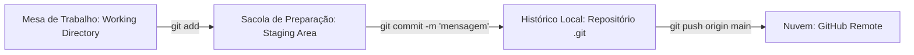

# 🧠 Revisão Visual: Versionamento Profissional com Git & GitHub

> **Curso:** Python para Desktop  
> **Módulo:** 00 — Central de Revisão Visual  
> **Nível:** Fixação Didática & Visual  
> **Tempo estimado de leitura:** 25 min  

---

## 🎯 Por que esta revisão é para você?

Se você já passou por desespero ao se perguntar:
* *"Por que não posso apenas copiar e colar a pasta como `projeto_v2_final_FINAL`?"*
* *"Qual a diferença real entre o Git instalado no meu PC e o GitHub na nuvem?"*
* *"O que fazem os 3 comandos mágicos: `add`, `commit` e `push`?"*

**Fique tranquilo!** O Git é a ferramenta mais valiosa no dia a dia de um desenvolvedor profissional. Nesta aula visual, vamos entender o Git usando a metáfora da **MÁQUINA DO TEMPO DO CÓDIGO**.

!!! abstract "💡 A Regra de Ouro do Git"
    - **Git**: É um sistema de controle de versão local (a câmera fotográfica que tira *snapshots* do seu código no seu PC).
    - **GitHub**: É uma plataforma na nuvem (o "Instagram do seu código") onde você salva seus projetos e constrói seu portfólio.

---

## 🏬 Metáfora do Mundo Real: A Câmera de Save no Jogo (Checkpoint)

=== "🎨 Metáfora Visual"
    - **Working Directory (Sua Mesa de Trabalho):** Onde você edita seus arquivos Python no VS Code.
    - **Staging Area (`git add`):** A sacola onde você coloca apenas os arquivos que quer incluir na foto.
    - **Commit (`git commit`):** O momento em que você bate a foto (savegame) com um bilhete explicativo do que mudou: *"Salvo no Chefão da Fase 2"*.
    - **Remote Push (`git push`):** Enviar o seu savegame da sua máquina para o servidor do jogo na nuvem (GitHub).

=== "💻 No Terminal"
    ```bash
    # 1. Colocar o arquivo alterado na sacola (Staging)
    git add main.py

    # 2. Bater a foto com mensagem descritiva (Commit)
    git commit -m "feat: adiciona tela de login e validacao de senha"

    # 3. Enviar para a nuvem no GitHub (Push)
    git push origin main
    ```

---

## 📊 O Fluxo dos 3 Estágios do Git (Mermaid)



---

## 🔍 Comandos Essenciais do Dia a Dia

<div class="grid cards" markdown>

-   :material-folder-plus: **`git init`**
    ---
    Transforma a pasta atual em um repositório Git monitorado.

-   :material-file-check-outline: **`git status`**
    ---
    Mostra o estado atual: quais arquivos foram modificados, criados ou estão prontos para commit.

-   :material-history: **`git log`**
    ---
    Exibe a linha do tempo histórica de todas as fotos/commits tiradas no projeto.

-   :material-cloud-upload-outline: **`git push` / `git pull`**
    ---
    `push`: envia suas alterações para o GitHub.  
    `pull`: baixa as novidades da nuvem para o seu PC.

</div>

---

## 💻 Na Prática: O Arquivo `.gitignore` e a Proteção de Segredos

NUNCA envie arquivos com senhas, chaves de API (`.env`) ou pastas temporárias (`__pycache__`) para o GitHub!

```text
# Arquivo .gitignore (na raiz do seu projeto)

# Ignorar arquivo de senhas e chaves privadas
.env

# Ignorar pastas de ambiente virtual Python
venv/
env/

# Ignorar arquivos temporários de compilação
__pycache__/
*.pyc

# Ignorar banco de dados SQLite local de teste
*.db
```

---

## ⚠️ Armadilhas & Erros Comuns

!!! danger "Erro #1: Fazer commit com mensagens vagas"
    * **RUIM ❌:** `git commit -m "arrumei umas coisas"` ou `git commit -m "update"`.
    * **BOM ✅:** `git commit -m "fix: corrige bug de divisao por zero no calculador"`.

!!! warning "Erro #2: Esquecer de configurar nome e e-mail no primeiro uso"
    No primeiro uso do Git no seu computador, configure sua identidade:  
    `git config --global user.name "Seu Nome"`  
    `git config --global user.email "seu.email@exemplo.com"`

---

## 🧪 Quiz Rápido de Fixação

1. **Qual a diferença entre `git commit` e `git push`?**
??? check "Ver Resposta Comentada"
    - `git commit` salva a foto do seu código **localmente no seu computador**.
    - `git push` envia esses commits salvos **para o GitHub na nuvem**.

2. **Para que serve o arquivo `.gitignore`?**
??? check "Ver Resposta Comentada"
    Para indicar ao Git quais arquivos e pastas **NÃO devem ser rastreados nem publicados** (como `.env` com senhas, banco SQLite local e cache).
