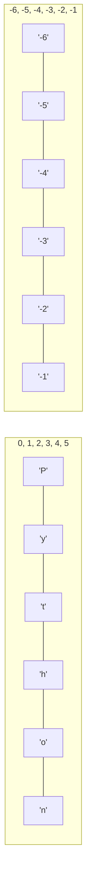

# 🧠 Revisão Visual: Manipulação de Strings e Textos

> **Curso:** Python para Desktop  
> **Módulo:** 00 — Central de Revisão Visual  
> **Nível:** Fixação Didática & Visual  
> **Tempo estimado de leitura:** 20 min  

---

## 🎯 Por que esta revisão é para você?

Se você já se fez perguntas como:
* *"Por que minha string não muda quando uso `texto.upper()`?"*
* *"Como fatiar (slicing) uma palavra para pegar só os primeiros 5 caracteres?"*
* *"Qual a diferença entre f-strings e concatenação com `+`?"*

**Fique tranquilo!** Strings são simplesmente sequências imutáveis de letras, números e símbolos. Nesta aula visual, vamos entender o fatiamento e os métodos de texto usando a metáfora do **Trilho de Trem com Vagões Numerados**.

!!! abstract "💡 A Regra de Ouro das Strings"
    - **Imutabilidade**: Strings são **imutáveis**! Métodos como `.upper()` ou `.strip()` **não alteram** a string original — eles devolvem uma **NOVA string** transformada.
    - **Fatiamento (`[inicio:fim]`)**: Pega um trecho do texto desde o índice `inicio` até ANTES do índice `fim`.

---

## 🏬 Metáfora do Mundo Real: O Trem de Caracteres

=== "🎨 Metáfora Visual"
    Imagine um trem onde cada vagão guarda uma única letra:
    - Vagão `[0]`: `'P'`
    - Vagão `[1]`: `'y'`
    - Vagão `[2]`: `'t'`
    - Vagão `[3]`: `'h'`
    - Vagão `[4]`: `'o'`
    - Vagão `[5]`: `'n'`  
    Para pegar apenas a palavra `"Py"`, você corta do vagão `[0]` até ANTES do vagão `[2]` (`texto[0:2]`).

=== "💻 No Python"
    ```python
    linguagem = "Python"

    print(linguagem[0])    # 'P'
    print(linguagem[-1])   # 'n' (último caractere!)
    print(linguagem[0:2])  # 'Py' (do 0 até antes do 2)
    ```

---

## 📊 Estrutura Visual de Índices Positivos e Negativos (Mermaid)



---

## 🔍 Os 4 Métodos Mais Úteis para Interfaces Gráficas

<div class="grid cards" markdown>

-   :material-format-title: **`.strip()` — Limpador de Espaços**
    ---
    Remove espaços extras nas pontas do texto (ex: `"  ana@email.com  "` ➔ `"ana@email.com"`).  
    **Uso:** Limpar inputs de formulários antes de salvar.

-   :material-format-letter-case-upper: **`.upper()` / `.lower()`**
    ---
    Converte todo o texto para MAIÚSCULAS ou minúsculas.  
    **Uso:** Padronizar buscas de texto (ex: busca case-insensitive).

-   :material-call-split: **`.split(separador)` — Fatiador**
    ---
    Quebra um texto em uma lista usando um caractere delimitador (ex: `"Ana,25,SP".split(",")` ➔ `["Ana", "25", "SP"]`).

-   :material-find-replace: **`.replace(antigo, novo)`**
    ---
    Substitui todas as ocorrências de um trecho de texto por outro (ex: `"R$ 10,50".replace(",", ".")`).

</div>

---

## 💻 Na Prática: Validação e Limpeza de E-mail de Cadastro

```python
email_bruto = "   ALUNO.CURSO@Gmail.COM   "

# 1. Limpar espaços nas pontas e converter para minúsculas
email_limpo = email_bruto.strip().lower()
print(f"E-mail Higienizado: '{email_limpo}'")  # 'aluno.curso@gmail.com'

# 2. Verificar se contém '@' e se termina com '.com'
if "@" in email_limpo and email_limpo.endswith(".com"):
    usuario, dominio = email_limpo.split("@")
    print(f"✅ Usuário: {usuario} | Provedor: {dominio}")
else:
    print("❌ E-mail inválido!")
```

---

## ⚠️ Armadilhas & Erros Comuns

!!! danger "Erro #1: Achar que `.strip()` altera a variável original"
    ```python
    nome = "  Carlos  "
    nome.strip()  # ❌ Não altera 'nome'!
    print(f"'{nome}'")  # Imprime '  Carlos  '

    # CORRETO ✅: Guarde o retorno em uma variável
    nome = nome.strip()
    ```

!!! warning "Erro #2: Concatenar strings com `+` dentro de loops"
    * Usar `texto += "novo"` em loops grandes gasta muita memória.
    * **Melhor prática:** Guarde os textos em uma lista e use `"".join(lista)` no final!

---

## 🧪 Quiz Rápido de Fixação

1. **O que é retornado em `"Python"[1:4]`?**
??? check "Ver Resposta Comentada"
    Retorna **`"yth"`** (caracteres dos índices 1, 2 e 3).

2. **Como pegar a última letra de qualquer palavra no Python sem saber o tamanho dela?**
??? check "Ver Resposta Comentada"
    Usando o índice negativo **`palavra[-1]`**!
