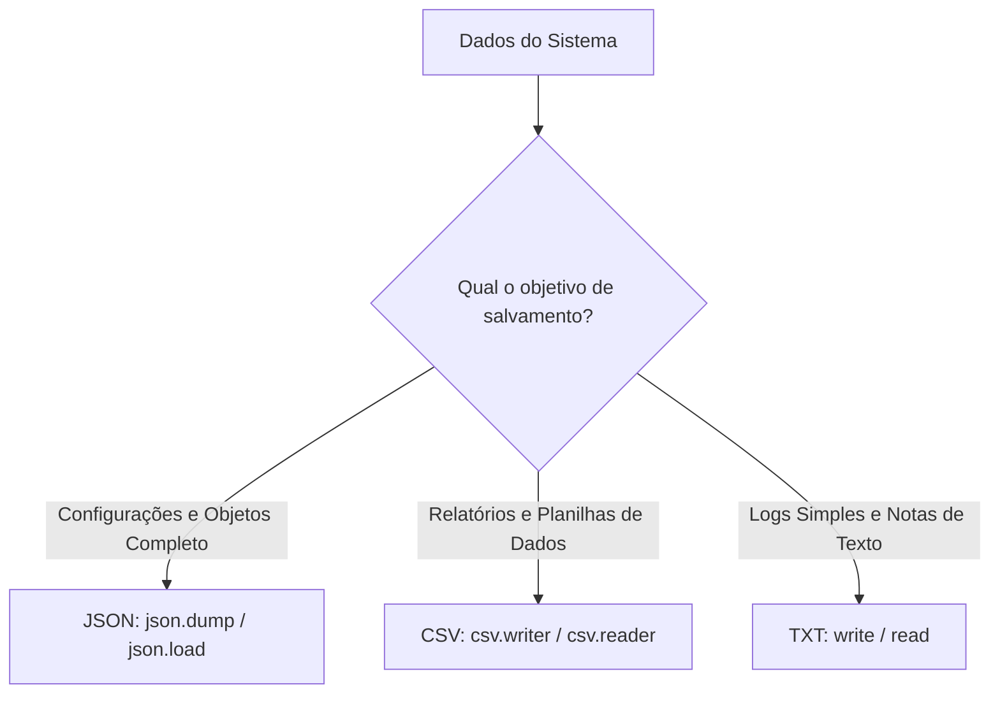

# 🧠 Revisão Visual: Manipulação de Arquivos (TXT, JSON e CSV)

> **Curso:** Python para Desktop  
> **Módulo:** 00 — Central de Revisão Visual  
> **Nível:** Fixação Didática & Visual  
> **Tempo estimado de leitura:** 20 min  

---

## 🎯 Por que esta revisão é para você?

Se você já se pegou em dúvida sobre:
* *"Por que meu arquivo ficou vazio depois que abri no modo `'w'`?"*
* *"Como salvar dados da aplicação em formato JSON para não perder ao fechar?"*
* *"Para que serve o bloco `with open(...)` e por que não preciso chamar `.close()`?"*

**Fique tranquilo!** Manipular arquivos no disco é a primeira forma de dar **persistência de dados** aos seus programas. Nesta aula visual, vamos entender como abrir, ler e salvar arquivos usando a metáfora do **Caderno de Anotações com Gerenciador de Acesso**.

!!! abstract "💡 A Regra de Ouro da Manipulação de Arquivos"
    - **Sempre use `with open(...) as f:`**: O gerenciador de contexto `with` garante que o arquivo será **fechado e salvo automaticamente**, mesmo se ocorrer um erro durante a leitura!
    - **Cuidado com os Modos**:
      - `'r'` = Leitura (Read)
      - `'w'` = Escrita (Sobrescreve TUDO!)
      - `'a'` = Anexar (Append no final)

---

## 🏬 Metáfora do Mundo Real: O Caderno de Anotações

=== "🎨 Metáfora Visual"
    - **Modo `'r'` (Leitura):** Abrir o caderno apenas para ler a página. Você não tem caneta na mão, não corre risco de rasurar.
    - **Modo `'w'` (Apagar e Reescrever):** Passar corretivo branquinho em **TODAS as páginas do caderno** e começar a escrever na primeira página em branco. (Cuidado! Apaga o que existia).
    - **Modo `'a'` (Adicionar ao Final):** Ir até a última linha escrita do caderno e continuar escrevendo a partir dali sem apagar nada antigo.

=== "💻 No Python"
    ```python
    # Escrever no arquivo (modo 'w')
    with open("notas.txt", "w", encoding="utf-8") as f:
        f.write("Primeira linha do arquivo\n")
        f.write("Segunda linha do arquivo\n")

    # Ler o arquivo (modo 'r')
    with open("notas.txt", "r", encoding="utf-8") as f:
        conteudo = f.read()
        print(conteudo)
    ```

---

## 📊 Comparativo dos Formatos de Arquivos em Aplicações Desktop (Mermaid)



---

## 🔍 Os 3 Formatos Mais Usados

<div class="grid cards" markdown>

-   :material-file-document-outline: **Arquivos TXT (Texto Puro)**
    ---
    **Uso:** Logs de sistema, anotações e mensagens simples.  
    **Funções:** `f.write()`, `f.read()`, `f.readlines()`.

-   :material-code-json: **Arquivos JSON (Estruturados)**
    ---
    **Uso:** Salvar dicionários e listas de configurações.  
    **Funções:** `json.dump(dados, f)`, `dados = json.load(f)`.

-   :material-table: **Arquivos CSV (Tabelados)**
    ---
    **Uso:** Exportar dados para abrir no Excel.  
    **Funções:** `csv.writer()`, `csv.DictReader()`.

</div>

---

## 💻 Na Prática: Lendo e Salvando Configurações em JSON

O formato JSON aceita dicionários e listas do Python nativamente:

```python
import json

# Dados de configuração da aplicação desktop
configuracao = {
    "tema": "dark",
    "volume": 80,
    "ultimos_acessos": ["2026-09-12", "2026-09-13"]
}

# 1. Salvar em arquivo JSON
with open("config.json", "w", encoding="utf-8") as f:
    json.dump(configuracao, f, indent=4, ensure_ascii=False)
print("✅ Configurações salvas em 'config.json'!")

# 2. Ler de volta do arquivo JSON
with open("config.json", "r", encoding="utf-8") as f:
    config_carregada = json.load(f)

print(f"Tema carregado: {config_carregada['tema']}")
```

---

## ⚠️ Armadilhas & Erros Comuns

!!! danger "Erro Fatal: Usar modo `'w'` achando que vai adicionar texto"
    Se você usar `open("dados.txt", "w")`, o Python **APAGA o conteúdo anterior** do arquivo imediatamente ao abrir!
    * Se quiser preservar o histórico e apenas adicionar no final, use **`open("dados.txt", "a")`** (Append).

!!! warning "Erro #2: Esquecer do parâmetro `encoding="utf-8"`"
    Se não especificar `encoding="utf-8"`, caracteres acentuados (`ç`, `ã`, `é`) podem quebrar quando o sistema rodar em computadores com idiomas diferentes (ex: Windows em inglês).

---

## 🧪 Quiz Rápido de Fixação

1. **Por que é altamente recomendado usar `with open(...) as f:` em vez de `f = open(...)`?**
??? check "Ver Resposta Comentada"
    Porque o bloco `with` **fecha o arquivo automaticamente** ao terminar, garantindo que os dados sejam salvos fisicamente no disco e liberando o arquivo para outros programas.

2. **Qual biblioteca padrão do Python usamos para salvar listas e dicionários no formato JSON?**
??? check "Ver Resposta Comentada"
    A biblioteca embutida **`json`** (usando `json.dump()` para salvar e `json.load()` para ler).
