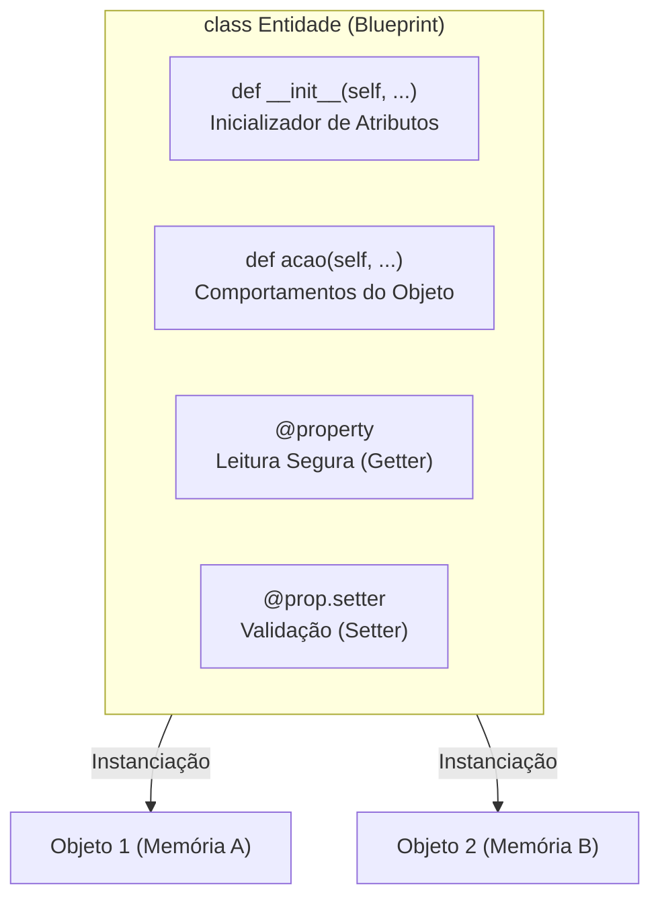

# 🧠 Revisão Visual: Programação Orientada a Objetos (POO)

> **Curso:** Python para Desktop  
> **Módulo:** 00 — Central de Revisão Visual  
> **Nível:** Fixação Didática & Visual  
> **Tempo estimado de leitura:** 20 min  

---

## 🎯 Por que esta revisão é para você?

Se você já se pegou em dúvida sobre:
* *"Para que serve o tal do `self` nas funções dentro da classe?"*
* *"Qual a diferença prática entre uma Classe e um Objeto?"*
* *"Por que usar `@property` em vez de simplesmente criar variáveis públicas?"*

**Fique tranquilo!** A Programação Orientada a Objetos (POO) é a espinha dorsal da criação de interfaces gráficas e softwares profissionais. Nesta aula visual, vamos desmistificar esses conceitos usando a metáfora da **Planta Arquitetônica da Fábrica de Automóveis**.

!!! abstract "💡 A Regra de Ouro da POO em Python"
    - **Classe = Planta / Blueprint:** O projeto no papel que define atributos (características) e métodos (ações).
    - **Objeto = A Instância Concreta:** O carro fabricado e rodando na rua com seu próprio endereço de memória.
    - **`self` = O Próprio Objeto em Execução:** A referência automática que conecta métodos aos atributos daquela instância específica.
    - **`@property` = O Porteiro de Validação:** Controla o acesso e impede que valores inválidos corrompam o estado do objeto.

---

## 🏬 Metáfora do Mundo Real: A Fábrica de Automóveis

=== "🎨 Metáfora Visual"
    - **A Classe (`class Carro`):** A planta da fábrica de carros. Ela não anda no trânsito, não gasta combustível e não ocupa vaga de garagem, mas define como todo carro será feito.
    - **O Objeto (`meu_carro = Carro()`):** O veículo montado na esteira da fábrica. Ele possui cor real, motor real e placa única.
    - **Os Atributos (`self.cor`, `self.velocidade`):** A cor da pintura e a velocidade no velocímetro do veículo.
    - **Os Métodos (`def acelerar(self)`):** Pressionar o pedal do acelerador para aumentar a velocidade do motor.
    - **A Propriedade (`@property def velocidade`):** O limitador eletrônico de velocidade que impede o motorista de ultrapassar os limites de segurança da fábrica.

=== "💻 No Python"
    ```python
    class Carro:
        def __init__(self, modelo: str, cor: str):
            self.modelo = modelo
            self.cor = cor
            self.__velocidade = 0 # Atributo privado

        def acelerar(self, incremento: int):
            self.velocidade += incremento

        @property
        def velocidade(self) -> int:
            return self.__velocidade

        @velocidade.setter
        def velocidade(self, nova_velocidade: int):
            if nova_velocidade < 0:
                raise ValueError("Velocidade não pode ser negativa!")
            self.__velocidade = nova_velocidade

    # Fabricando 2 carros independentes (Instanciação)
    carro_a = Carro("Corolla", "Prata")
    carro_b = Carro("Civic", "Preto")

    carro_a.acelerar(50)
    print(carro_a.velocidade) # 50 km/h
    print(carro_b.velocidade) # 0 km/h (Carro B permanece parado!)
    ```

---

## 📊 Arquitetura de uma Classe em Python (Mermaid)



---

## 🔍 Os 4 Pilares da Anatomia da POO

<div class="grid cards" markdown>

-   :material-shape: **1. Classe e Objeto**
    ---
    **Classe:** Estrutura moldada com `class NomeClasse:`.  
    **Objeto:** Instância criada com `obj = NomeClasse()`.

-   :material-database-cog: **2. O Construtor `__init__` e `self`**
    ---
    O método especial executado ao nascer do objeto. O `self` é o elo de ligação com o próprio objeto.

-   :material-shield-key: **3. Encapsulamento (`_` e `__`)**
    ---
    Proteção de dados internos: `_protegido` (convenção) e `__privado` (*name mangling* do Python).

-   :material-tune: **4. Propriedades (`@property`)**
    ---
    Sintaxe limpa de acesso (`obj.prop`) combinada com validações seguras no setter.

</div>

---

## ⚠️ Guia de Erros Comuns em POO

| Erro / Sintoma | Causa Comum | Como Corrigir |
|---|---|---|
| `TypeError: acao() takes 0 positional arguments but 1 was given` | Esqueceu de colocar o parâmetro `self` na definição do método. | Adicione `self` como primeiro parâmetro: `def acao(self):`. |
| `AttributeError: type object 'Carro' has no attribute 'cor'` | Tentou acessar um atributo de instância diretamente pela Classe em vez do Objeto. | Crie a instância primeiro: `c = Carro()`, depois acesse `c.cor`. |
| `RecursionError: maximum recursion depth exceeded` | Dentro do `@prop.setter`, você atribuiu ao mesmo nome da propriedade gerando loop. | Atribua ao atributo privado interno com prefixo underline (`self.__atributo = valor`). |

---

## 💡 Checklist de Fixação

- [ ] Consigo explicar a diferença entre uma classe (`blueprint`) e um objeto (`instância`).
- [ ] Sei para que serve o parâmetro `self` em métodos de instância.
- [ ] Sei proteger atributos usando `__` (dois underlines) para aplicar encapsulamento.
- [ ] Sei criar um getter com `@property` e um setter com `@property.setter` para validar dados.
