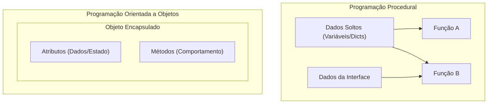
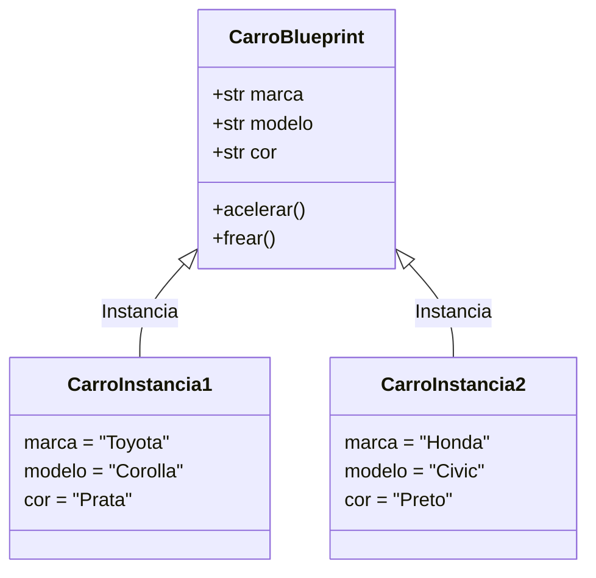

# 01. Estudo do Paradigma de Programação Orientada a Objetos (POO)

## Objetivos
Neste capítulo, você aprenderá a:
- Compreender o que é o paradigma de Programação Orientada a Objetos (POO).
- Diferenciar Programação Procedural de Programação Orientada a Objetos.
- Entender os conceitos fundamentais de **Classe** (molde) e **Objeto** (instância).
- Criar suas primeiras classes em Python usando a palavra reservada `class`.
- Instanciar objetos e acessar seus atributos.
- Representar relações entre classes e objetos utilizando diagramas `Mermaid.js`.

## Pré-requisitos
Antes de iniciar este capítulo, certifique-se de dominar:
- Variáveis, tipos de dados e operadores em Python.
- Estruturas condicionais (`if/else`) e laços de repetição (`for/while`).
- Funções, parâmetros e valores de retorno (`def`).
- Coleções (`list`, `dict`).

---

## Motivação: Por que aprender POO?

Até agora, escrevemos programas baseados principalmente na **Programação Procedural**: organizamos nosso código em sequências de instruções e funções que manipulam dados (variáveis isoladas ou dicionários). 

À medida que nossos softwares crescem — como uma aplicação Desktop com várias janelas, botões, relatórios e conexões com banco de dados —, a programação procedural pode se tornar difícil de manter. Os dados ficam desconectados das funções que os manipulam.

A **Programação Orientada a Objetos (POO)** resolve esse problema ao aproximar o código da forma como enxergamos o mundo real. Em vez de tratar dados e funções separadamente, a POO nos permite agrupar **dados** (atributos/propriedades) e **comportamentos** (métodos) dentro de uma única entidade chamada **Objeto**.



!!! tip "Vantagens da POO"
    - **Reutilização de Código:** Reduz duplicações ao criar estruturas modulares.
    - **Organização e Manutenibilidade:** Cada classe é responsável por sua própria lógica e estado.
    - **Aproximação com o Mundo Real:** Facilita a modelagem de entidades complexas (Clientes, Produtos, Janelas, Conexões).
    - **Espinha Dorsal de GUIs:** Frameworks de interface gráfica em Python (Tkinter, CustomTkinter, PySide) são 100% construídos sobre POO.

---

## Conceitos Fundamentais: Classe vs Objeto

Para dominar a POO, a primeira distinção importante é entender a diferença entre **Classe** e **Objeto**.

### O que é uma Classe?
A **Classe** é uma estrutura abstrata — um molde, gabarito ou *blueprint*. Ela define quais dados uma entidade possuirá e quais ações ela será capaz de realizar, mas não representa a entidade física em si.

> 💡 **Metáfora:** Pense em uma **planta arquitetônica de uma casa**. A planta define onde ficarão as portas, quantas janelas existirão e a altura do teto. No entanto, ninguém pode morar na planta arquitetônica.

### O que é um Objeto (Instância)?
O **Objeto** é a realização concreta da classe. É a entidade criada na memória a partir das especificações contidas no molde. O ato de criar um objeto a partir de uma classe é chamado de **instanciação**.

> 💡 **Metáfora:** A **casa construída na rua** com tijolos, tintas e móveis é o **Objeto**. Podemos construir 10 casas diferentes usando a mesma planta arquitetônica — cada casa terá sua própria cor, seu próprio endereço e seus próprios moradores.



---

## Criando a Primeiras Classe em Python

Em Python, definimos uma classe usando a palavra reservada `class`, seguida do nome da classe em padrão **PascalCase** (iniciais maiúsculas, ex: `ContaBancaria`, `Cliente`, `JanelaPrincipal`).

```python
class Carro:
    """Classe simples que representa um veículo."""
    pass
```

### Instanciando Objetos

Para criar um objeto a partir de uma classe, chamamos o nome da classe seguido de parênteses, exatamente como se fosse uma função:

```python
# Instanciando dois objetos da classe Carro
meu_carro = Carro()
carro_da_empresa = Carro()

print(meu_carro)
# Saída: <__main__.Carro object at 0x0000021A881B3FD0>
print(carro_da_empresa)
# Saída: <__main__.Carro object at 0x0000021A881B3F50>
```

Note que `meu_carro` e `carro_da_empresa` apontam para endereços de memória diferentes. São dois objetos independentes gerados a partir do mesmo molde.

---

## Atributos de Instância e Atributos de Classe

**Atributos** são as variáveis que pertencem a um objeto ou a uma classe. Eles representam as características ou o *estado* da entidade.

### Atributos Dinâmicos (Primeiro Contato)

Podemos atribuir características diretamente a um objeto após a sua criação:

```python
# Atribuindo atributos dinamicamente
meu_carro.marca = "Toyota"
meu_carro.modelo = "Corolla"
meu_carro.ano = 2024

carro_da_empresa.marca = "Fiat"
carro_da_empresa.modelo = "Uno"
carro_da_empresa.ano = 2018

print(f"Meu carro: {meu_carro.marca} {meu_carro.modelo} ({meu_carro.ano})")
print(f"Carro empresa: {carro_da_empresa.marca} {carro_da_empresa.modelo} ({carro_da_empresa.ano})")
```

!!! warning "Atribuição Dinâmica vs Boas Práticas"
    Embora o Python permita criar atributos dinamicamente fora da classe, essa não é uma boa prática. No próximo capítulo, aprenderemos a definir os atributos obrigatoriamente dentro do método construtor `__init__`, garantindo que todo objeto já nasça completo e padronizado.

### Atributos de Classe

Enquanto atributos de instância pertencem a um objeto específico, **atributos de classe** são compartilhados por todas as instâncias daquela classe:

```python
class Computador:
    # Atributo de classe (compartilhado por todos os computadores)
    sistema_operacional = "Windows 11"

# Acessando pela classe ou pelos objetos
pc1 = Computador()
pc2 = Computador()

print(Computador.sistema_operacional) # Windows 11
print(pc1.sistema_operacional)         # Windows 11
print(pc2.sistema_operacional)         # Windows 11
```

---

## Comparando Procedural vs POO na Prática

Imagine que estamos desenvolvendo um sistema de cadastro de produtos para um software Desktop.

### Abordagem Procedural (Dicionários e Funções Soltas)

```python
# Representação procedural
produto1 = {"nome": "Teclado Mecânico", "preco": 250.0, "estoque": 10}

def aplicar_desconto(produto, percentual):
    produto["preco"] -= produto["preco"] * (percentual / 100)

def exibir_produto(produto):
    print(f"{produto['nome']} - R$ {produto['preco']:.2f} (Estoque: {produto['estoque']})")

aplicar_desconto(produto1, 10)
exibir_produto(produto1)
```

**Problema:** Se esquecermos de passar um dicionário no formato correto para `aplicar_desconto`, o programa quebrará em tempo de execução com `KeyError`. Não há garantia de integridade da estrutura.

### Abordagem Orientada a Objetos

```python
class Produto:
    pass

p1 = Produto()
p1.nome = "Teclado Mecânico"
p1.preco = 250.0
p1.estoque = 10

print(f"Produto criado: {p1.nome}")
```

Ao encapsular o conceito de `Produto` dentro de uma classe, criamos um tipo de dado personalizado no Python, trazendo clareza, segurança e estrutura ao projeto.

---

## ⚠️ Erros Comuns

1. **Confundir Nome da Classe com Instância:**
   ```python
   # ❌ Errado: tentar acessar o atributo da instância usando o nome da classe
   print(Carro.marca) 
   # AttributeError: type object 'Carro' has no attribute 'marca'

   # ✅ Correto: instanciar primeiro e acessar o atributo no objeto
   c = Carro()
   c.marca = "Ford"
   print(c.marca)
   ```

2. **Esquecer os parênteses na Instanciação:**
   ```python
   # ❌ Errado: armazena a referência da CLASSE, não a instância!
   meu_carro = Carro 
   
   # ✅ Correto: inclui os parênteses para instanciar o objeto
   meu_carro = Carro()
   ```

---

## 📝 Exercícios de Fixação

1. **Criação de Classe Simples:**
   Crie uma classe chamada `Livro`. Instancie dois objetos dessa classe (`livro1` e `livro2`) e atribua dinamicamente os atributos `titulo`, `autor` e `paginas`. Exiba as informações no terminal usando f-strings.

2. **Modelagem de Entidade Desktop:**
   Crie uma classe `UsuarioSistema`. Instancie um objeto representando um administrador e atribua os atributos `nome`, `email` e `nivel_acesso` ("admin").

---

## 💡 Resumo do Capítulo

- **POO** é um paradigma de programação centrado em **Objetos**, unindo dados e comportamentos.
- **Classe** é o molde / especificação abstrata (`class NomeClasse:`).
- **Objeto** é a instância concreta gerada a partir do molde (`obj = NomeClasse()`).
- O padrão recomendado para nomear classes em Python é **PascalCase** (ex: `GerenciadorBancoDados`).
- Objetos instanciados ocupam seu próprio espaço na memória e mantêm seus próprios estados de atributos.
