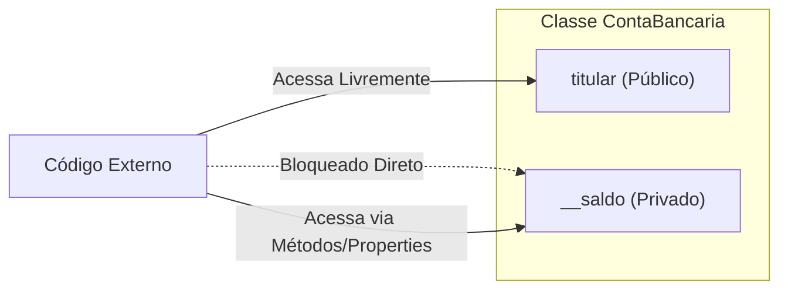

# 02. Conceitos de Métodos e Propriedades

## Objetivos
Neste capítulo, você aprenderá a:
- Utilizar o método construtor `__init__` para inicializar objetos com atributos padronizados.
- Compreender o papel fundamental do parâmetro `self` em métodos de instância.
- Criar **métodos de instância** para definir comportamentos e ações do objeto.
- Aplicar os conceitos de **encapsulamento** em Python (atributos públicos, protegidos `_` e privados `__`).
- Utilizar os decoradores `@property` e `@property.setter` para criar propriedades modernas com validação de dados.

## Pré-requisitos
Antes de iniciar este capítulo, certifique-se de dominar:
- O conceito de Classe e Objeto ([01. Estudo do Paradigma POO](01_paradigma_poo.md)).
- Definição de funções, parâmetros e escopo em Python.

---

## O Construtor `__init__` e o Parâmetro `self`

No capítulo anterior, vimos que era possível criar atributos dinamicamente nos objetos após a sua criação. Porém, isso gera insegurança: se esquecermos de definir um atributo em um objeto, o programa falhará ao tentar acessá-lo.

Para resolver isso, usamos o método especial **`__init__`** (conhecido como **construtor**). Ele é executado automaticamente pelo Python sempre que um novo objeto é instanciado.

```python
class ContaBancaria:
    def __init__(self, titular, saldo_inicial=0.0):
        """Método construtor da classe ContaBancaria."""
        self.titular = titular
        self.saldo = saldo_inicial
```

### Entendendo o `self`

O parâmetro **`self`** é a referência ao **próprio objeto que está sendo executado no momento**. 

Quando você escreve `self.titular = titular`, está dizendo ao Python: *"Pegue o valor recebido no parâmetro `titular` e guarde dentro da variável de instância `titular` deste objeto específico que acabou de nascer."*

```python
# Instanciando contas
conta_ana = ContaBancaria("Ana Silva", 1500.0)
conta_bruno = ContaBancaria("Bruno Costa") # Saldo padrão: 0.0

print(f"Titular: {conta_ana.titular} | Saldo: R$ {conta_ana.saldo:.2f}")
# Saída: Titular: Ana Silva | Saldo: R$ 1500.00

print(f"Titular: {conta_bruno.titular} | Saldo: R$ {conta_bruno.saldo:.2f}")
# Saída: Titular: Bruno Costa | Saldo: R$ 0.00
```

!!! note "Você não passa o `self` manualmente!"
    Ao instanciar `ContaBancaria("Ana Silva", 1500.0)`, você passa apenas `titular` e `saldo_inicial`. O Python passa a instância do objeto automaticamente como o primeiro argumento (`self`).

---

## Métodos de Instância: Definindo Comportamentos

**Métodos de Instância** são funções definidas dentro de uma classe que operam sobre os dados do próprio objeto (acessando ou alterando seus atributos através do `self`).

```python
class ContaBancaria:
    def __init__(self, titular, saldo_inicial=0.0):
        self.titular = titular
        self.saldo = saldo_inicial

    def depositar(self, valor):
        """Deposita um valor positivo na conta."""
        if valor > 0:
            self.saldo += valor
            print(f"Depósito de R$ {valor:.2f} realizado com sucesso.")
        else:
            print("Valor de depósito inválido.")

    def sacar(self, valor):
        """Realiza um saque se houver saldo suficiente."""
        if valor <= 0:
            print("Valor de saque deve ser maior que zero.")
        elif valor > self.saldo:
            print(f"Saldo insuficiente! Saldo atual: R$ {self.saldo:.2f}")
        else:
            self.saldo -= valor
            print(f"Saque de R$ {valor:.2f} realizado.")

    def exibir_extrato(self):
        """Exibe o resumo da conta."""
        print(f"--- EXTRATO ---")
        print(f"Titular: {self.titular}")
        print(f"Saldo Atual: R$ {self.saldo:.2f}\n")
```

### Testando os Métodos de Instância:

```python
minha_conta = ContaBancaria("Carlos Eduardo", 500.0)
minha_conta.exibir_extrato()

minha_conta.depositar(250.0)
minha_conta.sacar(100.0)
minha_conta.sacar(1000.0) # Tentativa de saque maior que o saldo

minha_conta.exibir_extrato()
```

---

## Encapsulamento em Python

**Encapsulamento** é o princípio de ocultar os detalhes internos de implementação de um objeto e proteger seus dados contra modificações indevidas vindas de fora da classe.

Imagina se qualquer código externo pudesse alterar diretamente o saldo de uma conta bancária sem passar pelas regras de `depositar` ou `sacar`:

```python
# Sem encapsulamento seguro:
minha_conta.saldo = -9999.0 # Perigo! Saldo negativo inserido diretamente
```

### Convenções de Visibilidade em Python

Diferente de linguagens como Java ou C# (que possuem palavras-chave rígidas como `private` e `public`), em Python o encapsulamento é gerido por **convenções de nomenclatura**:

| Modificador | Sintaxe | Descrição / Acesso |
|---|---|---|
| **Público** | `self.nome` | Acessível livremente de qualquer lugar. |
| **Protegido** | `self._nome` | Sugere uso apenas dentro da própria classe e suas subclasses. |
| **Privado** | `self.__nome` | O Python aplica *Name Mangling* para dificultar o acesso externo direto. |



### Exemplo com Atributos Privados (`__`):

```python
class ContaProtegida:
    def __init__(self, titular, saldo):
        self.titular = titular
        self.__saldo = saldo  # Atributo privado (dois underlines)

    def obter_saldo(self):
        return self.__saldo
```

Se tentarmos acessar `minha_conta.__saldo` diretamente de fora da classe, o Python disparará um erro:

```python
c = ContaProtegida("Mariana", 1000.0)
# print(c.__saldo) 
# AttributeError: 'ContaProtegida' object has no attribute '__saldo'

# Acesso seguro via método:
print(c.obter_saldo()) # 1000.0
```

---

## Propriedades: `@property` e `@property.setter`

Embora métodos como `obter_saldo()` e `definir_saldo()` funcionem, eles tornam a sintaxe verbosa. Em Python, a forma pythonica e moderna de implementar controle de acesso e validação é através de **Propriedades**.

Com propriedades, o código cliente acessa o atributo como se fosse uma variável comum (`objeto.atributo`), mas por baixo dos panos o Python executa funções decoradas com **`@property`** (getter) e **`@property.setter`** (setter).

### Exemplo Completo com Validação de Atributos:

```python
class Funcionario:
    def __init__(self, nome, salario):
        self.nome = nome
        self.salario = salario # Usa o setter automaticamente na inicialização!

    # GETTER para salario
    @property
    def salario(self):
        """Retorna o salário do funcionário."""
        return self.__salario

    # SETTER para salario (contém regra de validação)
    @salario.setter
    def salario(self, novo_salario):
        if not isinstance(novo_salario, (int, float)):
            raise TypeError("O salário deve ser um número válido.")
        if novo_salario < 1412.0: # Exemplo: Salário mínimo
            raise ValueError("O salário não pode ser inferior ao salário mínimo (R$ 1.412,00).")
        
        self.__salario = float(novo_salario)
```

### Testando a Propriedade:

```python
f1 = Funcionario("Fernanda", 3500.0)

# Acessando como se fosse atributo público (executa o @property getter):
print(f"Salário da Fernanda: R$ {f1.salario:.2f}")

# Atualizando com valor válido (executa o @salario.setter):
f1.salario = 4200.0
print(f"Novo Salário: R$ {f1.salario:.2f}")

# Tentando atribuir valor inválido (dispara exceção e protege os dados):
try:
    f1.salario = 800.0
except ValueError as e:
    print(f"Erro capturado: {e}")
```

---

## ⚠️ Erros Comuns

1. **Esquecer o parâmetro `self` na definição do método:**
   ```python
   # ❌ Errado:
   class Pessoa:
       def acenar(): # Faltou o self!
           print("Olá!")

   # p = Pessoa()
   # p.acenar() -> TypeError: Pessoa.acenar() takes 0 positional arguments but 1 was given
   
   # ✅ Correto:
   class Pessoa:
       def acenar(self):
           print("Olá!")
   ```

2. **Criar um Loop Infinito no Setter da Propriedade:**
   ```python
   # ❌ Errado: atribuir ao mesmo nome da propriedade no setter gera recursão infinita!
   @salario.setter
   def salario(self, valor):
       self.salario = valor # RecursionError!

   # ✅ Correto: atribuir ao atributo privado interno (ex: self.__salario ou self._salario)
   @salario.setter
   def salario(self, valor):
       self.__salario = valor
   ```

---

## 📝 Exercícios de Fixação

1. **Classe Produto com Propriedades:**
   Crie uma classe `Produto` que receba `nome` e `preco` no construtor.
   - O preço deve ser um atributo privado (`__preco`).
   - Crie uma propriedade `@property` para ler o preço.
   - Crie um setter `@preco.setter` que impeça que o preço seja menor ou igual a zero.

2. **Simulador de Cofre com Encapsulamento:**
   Crie uma classe `Cofre` com a senha salva de forma privada.
   - Crie um método `abrir(senha_digitada)` que retorna `True` se a senha for correta e `False` caso contrário.
   - Crie um método `alterar_senha(senha_atual, nova_senha)` que só permite a troca se a senha atual for validada.

---

## 💡 Resumo do Capítulo

- O método **`__init__`** inicializa os atributos da instância no momento da criação.
- **`self`** representa a instância atual do objeto em execução.
- **Métodos de Instância** definem ações e comportamentos associados aos dados do objeto.
- O **encapsulamento** oculta a complexidade interna e protege o estado usando convenções (`_` e `__`).
- **`@property`** e **`@property.setter`** fornecem controle e validação de atributos com sintaxe limpa e pythonica.
