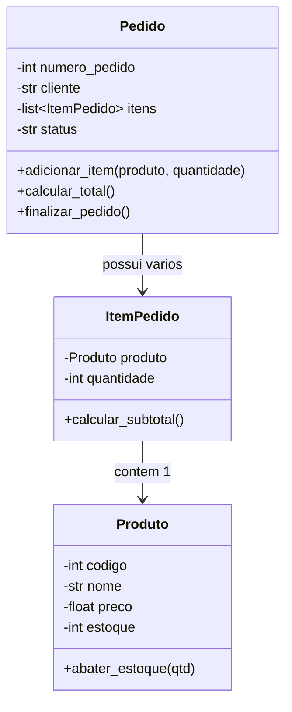

# 03. Desenvolvimento Prático de Programas Aplicando POO

## Objetivos
Neste capítulo, você aprenderá a:
- Modelar um sistema completo utilizando a Programação Orientada a Objetos.
- Conectar múltiplas classes através de conceitos de **composição** e relacionamentos.
- Estruturar o código separando **regras de negócio** (modelos) da **interação com o usuário**.
- Implementar métodos de gerenciamento de dados e validações robustas.
- Desenvolver um projeto prático funcional orientado a objetos pronto para integração com banco de dados e interfaces gráficas.

## Pré-requisitos
Antes de iniciar este capítulo, você deve dominar:
- Classes e Instanciação ([01. Estudo do Paradigma POO](01_paradigma_poo.md)).
- Métodos, Encapsulamento e Propriedades (`@property`) ([02. Conceitos de Métodos e Propriedades](02_metodos_e_propriedades.md)).
- Tratamento de Exceções (`try/except`) e manipulação de listas.

---

## Modelagem do Sistema Prático: Gerenciador de Pedidos

Para consolidar tudo o que aprendemos sobre POO, vamos desenvolver um **Sistema de Gerenciamento de Pedidos e Vendas**.

Em aplicações reais (especialmente sistemas Desktop de PDV ou Gestão Comercial), as entidades do mundo real conversam entre si. Vamos modelar três classes principais:

1. **`Produto`**: Representa um item do catálogo (código, nome, preço e estoque).
2. **`ItemPedido`**: Associa um `Produto` a uma quantidade solicitada.
3. **`Pedido`**: Gerencia o cliente, a lista de itens, o cálculo do valor total e o status da venda.



---

## Passo 1: Implementando a Classe `Produto`

A classe `Produto` cuida dos dados dos itens e garante que o preço e o estoque não recebam valores inválidos através de `@property`.

```python
class Produto:
    def __init__(self, codigo: int, nome: str, preco: float, estoque: int):
        self.codigo = codigo
        self.nome = nome
        self.preco = preco
        self.estoque = estoque

    @property
    def preco(self) -> float:
        return self.__preco

    @preco.setter
    def preco(self, valor: float):
        if valor <= 0:
            raise ValueError("O preço do produto deve ser maior que zero.")
        self.__preco = float(valor)

    @property
    def estoque(self) -> int:
        return self.__estoque

    @estoque.setter
    def estoque(self, quantidade: int):
        if quantidade < 0:
            raise ValueError("A quantidade em estoque não pode ser negativa.")
        self.__estoque = int(quantidade)

    def abater_estoque(self, quantidade: int):
        """Reduz o estoque do produto ao realizar uma venda."""
        if quantidade > self.estoque:
            raise ValueError(f"Estoque insuficiente para {self.nome}. Disponível: {self.estoque}")
        self.estoque -= quantidade

    def __str__(self):
        return f"[{self.codigo}] {self.nome} - R$ {self.preco:.2f} (Estoque: {self.estoque})"
```

---

## Passo 2: Implementando a Classe `ItemPedido` (Composição)

A classe `ItemPedido` combina a referência a um `Produto` existente com a quantidade comprada.

```python
class ItemPedido:
    def __init__(self, produto: Produto, quantidade: int):
        if quantidade <= 0:
            raise ValueError("A quantidade do item deve ser pelo menos 1.")
        
        self.produto = produto
        self.quantidade = quantidade

    def calcular_subtotal(self) -> float:
        """Calcula o valor subtotal do item (preço x quantidade)."""
        return self.produto.preco * self.quantidade

    def __str__(self):
        return f"{self.produto.nome} x {self.quantidade} = R$ {self.calcular_subtotal():.2f}"
```

---

## Passo 3: Implementando a Classe `Pedido` (Regras de Negócio)

A classe `Pedido` orquestra a venda, mantém a lista de itens, verifica a disponibilidade em estoque e finaliza o pedido.

```python
class Pedido:
    PROXIMO_NUMERO = 1001  # Atributo de classe para gerar números sequenciais

    def __init__(self, cliente: str):
        self.numero = Pedido.PROXIMO_NUMERO
        Pedido.PROXIMO_NUMERO += 1
        
        self.cliente = cliente
        self.itens: list[ItemPedido] = []
        self.status = "Pendente"

    def adicionar_item(self, produto: Produto, quantidade: int):
        """Adiciona um produto ao pedido validando o estoque."""
        if self.status != "Pendente":
            raise InvalidOperationError("Não é possível alterar um pedido já finalizado.")
        
        # Tenta abater o estoque antes de confirmar o item no pedido
        produto.abater_estoque(quantidade)
        item = ItemPedido(produto, quantidade)
        self.itens.append(item)
        print(f"✅ Item '{produto.nome}' ({quantidade}x) adicionado ao Pedido #{self.numero}.")

    def calcular_total(self) -> float:
        """Soma o subtotal de todos os itens do pedido."""
        return sum(item.calcular_subtotal() for item in self.itens)

    def finalizar_pedido(self):
        """Finaliza a venda se houver itens no pedido."""
        if not self.itens:
            raise ValueError("Não é possível finalizar um pedido sem itens.")
        
        self.status = "Concluído"
        print(f"🎉 Pedido #{self.numero} do(a) cliente '{self.cliente}' finalizado com SUCESSO!")

    def exibir_resumo(self):
        """Exibe o cupom detalhado do pedido."""
        print("\n" + "="*40)
        print(f"   RESUMO DO PEDIDO #{self.numero}")
        print(f"   Cliente: {self.cliente}")
        print(f"   Status: {self.status}")
        print("="*40)
        for item in self.itens:
            print(f" - {item}")
        print("-" * 40)
        print(f" TOTAL A PAGAR: R$ {self.calcular_total():.2f}")
        print("="*40 + "\n")
```

---

## Executando o Programa Completo

Agora vamos simular a execução do nosso programa orientado a objetos:

```python
# 1. Criando catálogo de produtos
p1 = Produto(1, "Notebook Gamer", 4500.0, 5)
p2 = Produto(2, "Mouse Sem Fio", 120.0, 15)
p3 = Produto(3, "Teclado Mecânico RGB", 280.0, 8)

print("--- CATÁLOGO INICIAL ---")
print(p1)
print(p2)
print(p3)
print()

# 2. Criando um novo pedido para a cliente "Mariana Souza"
pedido1 = Pedido("Mariana Souza")

try:
    # Adicionando itens ao pedido
    pedido1.adicionar_item(p1, 1) # 1 Notebook
    pedido1.adicionar_item(p3, 2) # 2 Teclados

    # Exibindo o resumo parcial
    pedido1.exibir_resumo()

    # Finalizando a compra
    pedido1.finalizar_pedido()

except ValueError as erro:
    print(f"❌ Erro na operação: {erro}")

# 3. Verificando o estoque atualizado após a venda
print("--- ESTOQUE ATUALIZADO ---")
print(p1) # Estoque deve ter caído de 5 para 4
print(p3) # Estoque deve ter caído de 8 para 6
```

---

## Boas Práticas no Desenvolvimento em POO

1. **Princípio da Responsabilidade Única (SRP):** Cada classe deve ser responsável por uma única parte do sistema. `Produto` gerencia dados do produto; `Pedido` gerencia o carrinho de compras.
2. **Reutilização via Composição:** Prefira compor classes (passar um objeto `Produto` para um `ItemPedido`) em vez de duplicar atributos como `nome_do_produto` e `preco_do_produto`.
3. **Validação nas Entradas:** Use os setters das propriedades para garantir que um objeto nunca entre em um estado corrompido ou inválido.

---

## 📝 Desafio Prático: Sistema de Gestão de Frota

Crie um programa POO para gerenciar uma frota de veículos de uma empresa:
- Crie uma classe `Motorista` com `nome`, `cnh` e `status` ("Disponível" / "Em Viagem").
- Crie uma classe `Veiculo` com `placa`, `modelo`, `quilometragem` e o motorista atribuído.
- Crie um método `iniciar_viagem(distancia_km)` na classe `Veiculo` que atualiza a quilometragem do veículo e altera o status do motorista para "Em Viagem".
- Garanta que uma viagem só possa ser iniciada se houver um motorista atribuído e se ele estiver com status "Disponível".

---

## 💡 Resumo do Módulo

Neste módulo de Programação Orientada a Objetos:
- Aprendemos o conceito de **Classes** (moldes) e **Objetos** (instâncias).
- Dominamos o método construtor **`__init__`** e a referência **`self`**.
- Vimos como **encapsular** atributos e expô-los com segurança usando **`@property`**.
- Conectamos objetos por **composição** e desenvolvemos um software desktop modular, limpo e profissional!
