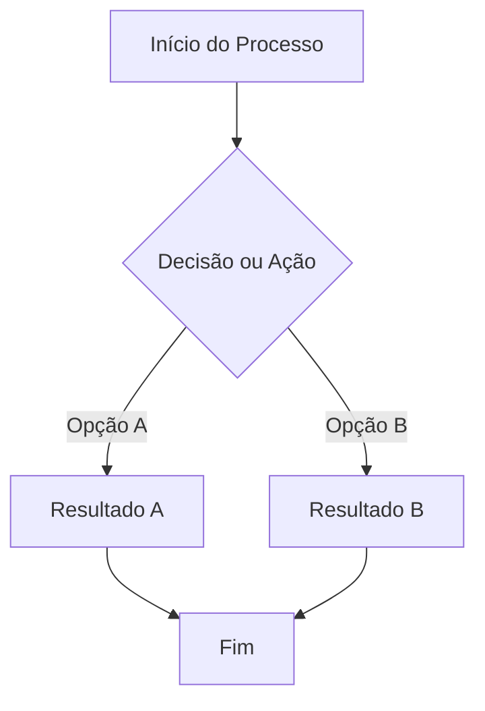

# 🧠 Revisão Visual: {{ nome }}

> **Curso:** {{ curso_nome }}  
> **Módulo:** {{ modulo_nome }}  
> **Nível:** Fixação / Visual  
> **Tempo estimado:** 30–40 min

---

## 🎯 Por que esta revisão é para você?

Se você sentiu qualquer dúvida ou insegurança sobre **{{ nome }}**, este capítulo foi feito sob medida para você. Aqui vamos trocar o juridiquês de programação por metáforas visuais e fluxogramas claros.

!!! abstract "💡 A Regra de Ouro"
    {{ objetivo if objetivo else "Aprender este conceito de forma 100% visual e intuitiva." }}

---

## 🏬 Metáfora do Mundo Real

Pense neste conceito como uma situação simples do seu dia a dia:

=== "🎨 Metáfora Visual"
    Descreva aqui uma metáfora física (ex: uma caixa etiquetada, uma fila de banco, um controle remoto).

=== "💻 No Python"
    Descreva como a metáfora se traduz diretamente em código Python.

---

## 📊 Fluxograma do Conceito



---

## 🔍 Comparativo Visual

<div class="grid cards" markdown>

-   :material-eye-outline: **O que parece ser?**
    ---
    Explicação sobre o mito ou confusão comum.

-   :material-check-circle-outline: **O que realmente acontece?**
    ---
    O conceito desmistificado em linguagem simples.

</div>

---

## 💻 Na Prática (Passo a Passo)

=== "Código"
    ```python
    # Adicione aqui o código de exemplo bem comentado
    ```

=== "Passo a Passo na Memória"
    - **Linha 1:** O Python lê o comando e...
    - **Linha 2:** O valor muda para...

=== "Resultado"
    ```text
    Saída no terminal
    ```

---

## ⚠️ Armadilhas e Erros Comuns

!!! danger "Erro Mais Comum"
    Descreva o erro típico que acontece ao praticar este conceito e como evitá-lo.

!!! warning "Fique Atento"
    Dica prática de sintaxe ou alinhamento (ex: indentação, aspas, maiúsculas/minúsculas).

---

## 🧪 Teste Rápido de Fixação

1. **Como você explicaria este conceito para uma criança de 10 anos?**
??? check "Ver Resposta Sugerida"
    Usando a metáfora que aprendemos acima!

---

## ➡️ Próximo Passo

Parabéns por revisar este tema! Agora você está pronto para voltar aos exercícios com total confiança.
